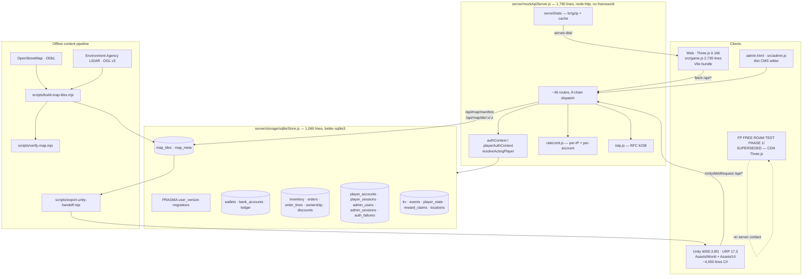

# Master Repository Audit — TRP23 / TRAP MADE IT

**Audit date:** 3 August 2026
**Repository:** `github.com/trp23dev-cell/TRP23` · branch `main` · commit `c537d63a` · 85 commits · 271 tracked files
**Auditor scope:** every tracked file read or inspected; all four quality gates executed; four defects reproduced against a live throwaway server.

> **Relationship to `Bible_Planning_Devwork.MD` (27 July 2026).**
> That document is a genuine audit and roadmap, and it remains the source of truth for the Bible doctrine and the phase plan. It is **40 commits stale** on engineering facts. This document supersedes its Part 1 (the audit) and consolidates what is still accurate rather than repeating it. Where the two disagree about the state of the code, **this document is correct**. Where they disagree about doctrine or brand, **`Bible_Planning_Devwork.MD` is correct**. §F sets out the full source-of-truth map.

---

## A. Executive assessment

### What TRP23 currently is

TRP23 is **a working browser game with a real, server-authoritative backend, built on a real 4km² reconstruction of Lincoln.** It is not a mockup, and it is further along than the documentation in the repository claims — in some places by a wide margin, and in one place in the wrong direction.

Concretely, today, a person can open the site, create an account with TOTP two-factor authentication, and walk around the actual city centre of Lincoln — the High Street climb, Steep Hill, the Castle and the Cathedral on their real elevations, built from OpenStreetMap geometry and Environment Agency LIDAR terrain. Buildings have collision. There is weather, a day-arc tied to progress, kerbs and pavements, procedurally drawn brick and shopfront facades. They can walk into a chapter, complete missions, earn coins into a genuine SQLite ledger, walk into the NatWest on Mint Street and deposit those coins into a bank, and buy a drop that decrements real inventory inside a transaction.

That is a substantial achievement for 85 commits, and it is the thing to hold onto while reading the rest of this document.

### What can actually run today

Verified by execution on 3 August 2026, not by reading:

| Command | Result |
|---|---|
| `npm run build` | ✅ Passes. 41 modules, 3.01s. Warns on chunk size (see D6). |
| `npm run validate:rooms` | ✅ Passes — "registry preflight: clean" |
| `npm run test:api` | ✅ Passes — all route checks |
| `npm run check:repo` | ✅ Passes — "271 tracked files, no credentials or databases" |
| `npm run check:api` | ✅ Passes — 18/18 security checks |

The Unity project (`Unity/TRP23`, Unity 6000.3.8f1, URP 17.3.0) opens and has a one-click `TRAP > Build World Test Scene` menu item that assembles a scene streaming the same Lincoln tiles from the same server. It could not be built headlessly in this environment (no Unity licence available here), so its runtime state is **asserted from source, not verified** — see C and D14.

### The strongest parts

1. **The map pipeline.** `scripts/build-map-tiles.mjs` (1,189 lines) turns OSM + LIDAR into projected, simplified, tiled game geometry stored in SQLite, served compressed and cached. Licences (ODbL, OGL v3) are documented at source, carried into the manifest, and displayed in the client. This is the single most valuable and least replaceable asset in the repository.
2. **The economy transaction layer.** `server/storage/sqliteStore.js` wraps every balance change in a `db.transaction()`, refuses to drive a balance negative, and writes a ledger row for every movement. Checkout reserves stock, debits coins and consumes a discount atomically. The *primitives* are right.
3. **The security hardening done since 27 July.** Staff registration closed behind a bootstrap token, CORS moved from `*` to an allowlist, per-IP *and* per-account rate limiting with the account lockout persisted to disk so it survives a redeploy, scrypt password hashing with transparent upgrade from legacy SHA-256. All of it is covered by `check:api`, which tests the *restart* case — a level of rigour most projects this age do not have.
4. **The engineering culture visible in the code.** Comments explain *why*, record what broke, and name the trade-off. `rateLimit.js` explains why per-IP counts live in memory and per-account counts live on disk. `freeRoamWorld.js` explains why the block starts at dusk and not at night. This is unusually good and it is a real asset when the team grows.
5. **Content is versioned and migrates.** `defaultContent.js` carries a `version`, the server replaces older stored content on boot, the client storage key is bumped alongside. This was learned from a real bug (Build_Progress 6.2) and the fix is properly generalised.

### The weakest parts

1. **The economy is not actually server-authoritative, despite the architecture being built for it.** Three routes hand control to the client. Proven, not theorised — see D1. The ledger primitives are sound; the routes above them give the money away.
2. **There is no real money anywhere.** No payment processor, no addresses collected, no tax, no shipping, no fulfilment beyond a database row with a fake tracking number. The commerce system is a complete simulation of commerce. This is unchanged since 27 July and remains the single biggest gap between the project and a business.
3. **No test suite.** `smoke-api.mjs` is route liveness; `check-api-security.mjs` is a genuine security suite but covers only auth, CORS and rate limiting. **Zero tests cover the economy** — which is precisely where the defects are, and why all five gates pass green over a route that mints a billion coins.
4. **Three clients, one of them abandoned in place.** Web (`src/game.js`), the standalone spike (`FP FREE ROAM TEST PHASE 1/`, tracked, 479 lines, superseded), and Unity. See §G for the recommendation you asked for.
5. **`docs/_superseded/COMPLETION-STATUS.md` is actively misleading** — see below.

### What is misleadingly described as complete

**`docs/_superseded/COMPLETION-STATUS.md` marks 21 of 21 line items "COMPLETE".** It includes commerce, player progress, admin/ops dashboard, and "Moral Vision Protection". Its own footnote admits "complete" means "scaffolding exists" — but the word above the footnote is what gets remembered, and it is the document a reader meets first.

Against reality: the Admin/Ops Dashboard is marked "COMPLETE (backend scope)" while `src/admin.js` is 176 lines that edit chapter and drop text and cannot view an order, process a refund, or moderate a story. "Progress over reckless behavior: COMPLETE" describes a daily claim cap on a route that lets the client name its own reward.

**Recommendation: mark this file superseded rather than delete it** (per your brief's instruction not to auto-delete). It records what was requested at the time, which has historical value; it just must stop being read as status.

**`README.md` documents infrastructure that does not exist.** It describes `.github/workflows/quality-gates.yml`, `ios-testflight.yml` and `android-release.yml`, `.env.ios.example`, `.env.android.example`, and `npm run ios:open`. **`.github/` is absent. `ios/` and `android/` are absent. No `.env.*.example` exists.** Nothing runs on push. This was flagged on 27 July as Critical #5 and is the one Critical item from that audit that has not been addressed.

### What is preventing the next convincing demo

Nothing structural. The demo is *close*. What is missing is authored content, not systems: the block has no interiors between chapters, no NPCs, no props on the street, and every garment is `"placeholder-front"`. A player who walks Lincoln for ninety seconds runs out of things to do. That is a content and art problem sitting on top of a working engine — the good position to be in.

### What is preventing a secure public release

The three money defects (D1), the absent CI (D5), the absence of any GDPR/data-protection posture while collecting email and phone from UK consumers (D12), and no error monitoring. The deploy is live on Railway *now* with the faucet open.

### What is preventing the long-term open-world vision

The client architecture decision (§G), the absence of real 3D and garment assets, and the fact that no NPC, mission-authoring, or persistence-beyond-progress system exists. The world is currently a beautiful, empty, accurate city.

---

## B. Architecture map



### Data flows that matter

**The map is server-owned and both clients read the same bytes.** This is the most important architectural fact in the repository and it is the thing that changed most since 27 July. Neither client ever contacts OpenStreetMap. `src/world/mapStream.js` (759 lines) and `Unity/.../WorldStreamer.cs` (457 lines) are two implementations of one contract: `GET /api/map/manifest`, then `GET /api/map/tile/{x}/{z}` for a 3×3 block around the player, with empty tiles answered `200 {b:[],r:[],empty:true}` so the streamer's cache logic stays simple. Geometry is triangulated by shared logic — `src/world/buildingMesh.js` is imported by the *build script*, so the tiles are pre-shaped consistently for both.

**The ownership boundary is drawn correctly in `PUT /api/player/:id` and nowhere else.** That route explicitly refuses client-supplied wallet, bank, inventory and `trustStatus`, merging only narrative progress and cosmetic entitlement codes. The comment above it states the principle exactly right. The three defective routes in D1 violate the same principle the same file states.

**Two storage tiers, deliberately separated.** `shippedDir` (read-only, replaced each deploy, holds `map-export.json.gz`) vs `storageDir` (`DATA_DIR`, the Railway volume, holds the database). `/api/health` reports `persistentStorage: !!process.env.DATA_DIR` so a misconfiguration is detectable from outside. This is good design and was learned from losing accounts.

**A vestigial JSON-blob tier persists alongside SQLite.** `refunds`, `fulfillments`, `releases`, `moderation`, `stories`, `opportunities`, `chapterEvents`, `audit` are read/written through `readJson`/`writeJson` into the `kv` table rather than into relational tables. Orders are relational; refunds *of* those orders are a JSON array. See D7.

---

## C. Feature inventory

Classification key: **✅ Complete and verified** · **🔵 Working prototype** · **🟡 Partially implemented** · **⚪ Placeholder/mock** · **📄 Documented only** · **🔴 Broken** · **♻️ Duplicated** · **🗑️ Obsolete** · **❓ Unknown pending verification**

### Identity and accounts

| Feature | State | Evidence |
|---|---|---|
| Guest session (adopt-or-mint playerId) | ✅ | `mockApiServer.js:777` `/api/players/session`; first-claim-wins on unclaimed ids |
| Player registration (username/email/phone/password) | ✅ | `:801`; `validateSignup` `:17`; scrypt via `hashPlayerPassword` |
| Player login, identifier = username *or* email | ✅ | `:856`; verified by `check:api` |
| TOTP 2FA (setup / enable / disable) | ✅ | `server/totp.js` (87 lines, RFC 6238); routes `:906`–`:965` |
| Per-account lockout surviving restart | ✅ | `rateLimit.js` + `auth_failures` table; **explicitly tested** in `check-api-security.mjs` |
| Staff accounts + bootstrap-token first admin | ✅ | `:661`; `scripts/create-admin.mjs`; 6 checks in `check:api` |
| Role gating (`admin`/`ops`/`product`/`viewer`) | 🟡 | `requiresRole` applied to CMS/ops/commerce-admin routes but **missing on `GET /api/commerce/orders`** — see D1c |
| Password reset / email verification | ❌ absent | No route, no mailer. Nobody can recover an account. |

### Economy

| Feature | State | Evidence |
|---|---|---|
| Wallet + bank balances, atomic | ✅ | `sqliteStore.js:442` `postTransaction`, `:449` `transferInternal`, `applyBalance` refuses negative |
| Append-only ledger with `balanceAfter` | 🟡 | `ledger` table `:39`. Single-entry, no idempotency key, no double-entry counterpart — D2 |
| Player-to-player transfer | 🔵 | `:477` `transferBetweenPlayers`; route `:1738`. Atomic, but unlimited and unlogged for AML purposes |
| Checkout (stock reserve + debit + discount, one txn) | ✅ | `sqliteStore.js:587` `createOrder`; route `:1221` |
| Refunds | 🟡 | `sqliteStore.js:642` `refundOrder` is atomic; but the refund *record* is a JSON blob — D7 |
| Reward claim dedupe (`playerId:levelId:missionId`) | ✅ | `:814` `claimReward`, atomic |
| **Reward claim amount** | 🔴 | **Client-supplied.** `mockApiServer.js:1396` reads `body.rewardCoins` — D1a |
| **Wallet top-up** | 🔴 | **Unlimited faucet**, no payment processor — D1b |
| Real payments (Stripe/etc.) | ❌ absent | No dependency, no route, no key. `grep -i stripe` → nothing |
| Two-currency model (Trap Coins / TRP) | 📄 | Recommended in `Bible_Planning_Devwork.MD` Tension 2. Schema has one balance. Undecided. |

### World

| Feature | State | Evidence |
|---|---|---|
| Lincoln from OSM, 4km² to the ring road | ✅ | `build-map-tiles.mjs:47` `DEFAULT_BBOX`; `map_tiles` table populated; `map-export.json.gz` ships |
| LIDAR terrain (5m grid, real elevation) | ✅ | `scripts/lib/terrainSource.mjs`, `geotiff.mjs`, `osgb.mjs`; `src/world/terrain.js` |
| Tile streaming 3×3 around player | ✅ | `src/world/mapStream.js`; `Unity/.../WorldStreamer.cs` |
| Building collision (spatial grid, `CELL = 25`) | ✅ | `freeRoamWorld.js:32`; Unity `WorldCollision.cs`; `npm run check:world` exists |
| Procedural facades, brick, shopfronts | ✅ | `src/world/cityTextures.js` (695 lines); Unity `CityTextures.cs` (351) |
| Landmarks authored, not extruded (Castle, Cathedral) | ✅ | commit `4dd9693f`; `buildingMesh.js`, `classify.mjs` |
| Weather + sun angle + progress-driven day arc | ✅ | `MOODS` `freeRoamWorld.js:44`; commit `279993cb` |
| Kerbs and pavements | ✅ | commit `d4e29a0b`; `SurfaceMeshBuilder.cs` |
| Minimap / big map / compass / waypoints | ✅ | `src/world/bigMap.js`; `TrapMinimap.cs` (447 lines) |
| Anchored real premises (JD, NatWest, Kimani's) | ✅ | `src/world/lincolnAnchors.json`, pinned by OSM id not name |
| Interiors between chapters | ❌ absent | Named as an open question in `Build_Progress.md` |
| NPCs / crowds / traffic | ❌ absent | No code of any kind |
| `src/data/defaultWorld.js` location list | 🗑️ | Placeholder coords `x:0,40,80`; **stale chapter names** ("The Cook Up", "Graveyard Shift"). Superseded by the real map; still served by `/api/world/locations` and used to validate checkout `locationId` |

### Gameplay and content

| Feature | State | Evidence |
|---|---|---|
| Six chapters, missions, rewards, chapter deal codes | 🔵 | `src/data/defaultContent.js` |
| Case-file board (the Bible flip) | ✅ | `game.js` boardTex; `Build_Progress.md` §1 |
| Chapter gating in order, locked-door refusal | ✅ | `game.js:1616` `enterChapter` |
| Return-to-block hub loop | ✅ | `game.js:1553` `loadWorld`, `:1629` `returnToWorld` |
| `moralFocus` rendered in-game | ✅ | Fixed in Session 1; was loaded-but-never-drawn |
| Product inspect viewer | 🔵 | `game.js` `buildGarment`, `heroDisplay`, `clothingRack` |
| **Room 3D assets** | ⚪ | `roomAssetRegistry.js` — six `createRoomAssetTemplate()` calls, all `enabled:false`, all `modelUrl:null`. **Also carries stale labels** ("The Cook Up", "The Front") |
| **Garment assets** | ⚪ | Every drop `media` is `"placeholder-front"`/`"placeholder-back"` |
| Mission `type`/`requirement`/`limit` driving behaviour | ⚪ | Fields exist in CMS and are decorative — `Build_Progress.md` 8.3 |
| "Name your trap" card, Weekly Self Audit, Trapologist rank | 📄 | `Build_Progress.md` 7.1, 8.1, 8.2 — the Bible's core mechanics, unbuilt |

### Platform and ops

| Feature | State | Evidence |
|---|---|---|
| SQLite migrations via `PRAGMA user_version` | ✅ | `sqliteStore.js:6`; append-only discipline documented |
| Audit log | 🟡 | `logAudit` on privileged actions; stored as JSON blob; `GET /api/ops/audit` admin-gated |
| Analytics | 🟡 | `/api/ops/analytics` computes conversion/retention proxies over `events` |
| Moderation queue | 🟡 | API only, no UI, no automated triage |
| Admin UI | 🟡 | 176 lines; chapter/drop text only |
| Static serving, brotli + immutable caching | ✅ | `serveStatic`; measured 1287 KB → 550 KB (commit `6f3b0947`) |
| **Deep-link SPA fallback** | 🔴 | `mockApiServer.js:1772` calls `serveStatic(res, "/index.html")` — 2 args to a 3-arg function. **Verified: `/some/deep/link` → HTTP 404** |
| Railway deploy + volume + readiness in `/api/health` | ✅ | `railway.json`, `nixpacks.toml`, `docs/RAILWAY-DEPLOY.md` |
| **CI / GitHub Actions** | 🔴 | **Absent.** README documents three workflows; `.github/` does not exist |
| **iOS / Android projects** | 📄 | `capacitor.config.ts` only. No `ios/`, no `android/`, no `.env.*.example` |
| Error monitoring / crash reporting | ❌ absent | Nothing |

### Unity client

All ❓ **pending verification** — no Unity licence in this environment, so nothing below was run. Assessed from source.

| Feature | State | Evidence |
|---|---|---|
| Map streaming from the shared server | ❓/🔵 | `MapClient.cs` (164), `WorldStreamer.cs` (457); retry/backoff on manifest |
| Mesh building, terrain, collision, atmosphere | ❓/🔵 | `BuildingMeshBuilder.cs` (663), `TerrainMeshBuilder.cs`, `WorldCollision.cs`, `WorldAtmosphere.cs` |
| One-click scene assembly | ❓/🔵 | `Editor/TrapWorldSetup.cs` — `TRAP > Build World Test Scene` |
| UI Toolkit menu + HUD | ❓/🔵 | `TrapMenuController.cs`, `TrapHudController.cs`, `.uxml`/`.uss` |
| Auth + wallet services | ❓/🟡 ♻️ | `HttpAuthService.cs` (192) hits the real API; `MockAuthService.cs` (87) **re-implements the web's signup regex by hand** — D9 |
| Player controller | ⚠️ | `ThirdPersonController.cs` is Asset Store *Starter Assets*, Unity Companion Licence. **The folder is gitignored except this one file** — a fresh checkout has no character and falls back to `FlyCamera`. Deliberate and documented in `.gitignore`, but it means the repo does not clone-and-run |
| C# compile check without Unity | ✅ | `tools/csharp-check` + `UnityStubs.cs`; `npm run check:csharp` |
| Collision geometry check | ✅ | `tools/collision-check`; `npm run check:world` |

### Obsolete / superseded

| Item | State | Note |
|---|---|---|
| `TRAP-MADE-IT-game.html` (1.1 MB) | 🗑️ | Original single-file prototype. Kept for reference per README. **Largest file in the repo** |
| `FP FREE ROAM TEST PHASE 1/` (479 lines, tracked) | 🗑️ ♻️ | Standalone spike, CDN Three.js, no server contact. Its purpose — prove free-roam feel — is fulfilled and absorbed into `freeRoamWorld.js`. `Bible_Planning_Devwork.MD` calls it "untracked"; **it is tracked** |
| `src/data/defaultWorld.js` | 🗑️ | Superseded by the real map; still load-bearing for `locationId` validation |
| `docs/_superseded/COMPLETION-STATUS.md` | 🗑️ | See §A |
| `docs/_superseded/JUNIOR-HANDOFF.md`, `docs/_superseded/PHASE2-FOUNDATION.md` | 🗑️ | Describe the Phase 1/2 structure, predate everything since |
| `pnpm-lock.yaml`, `pnpm-workspace.yaml` | 🗑️ | Gitignored but **present on disk** — the build-tool ambiguity that broke Railway |

---

## D. Technical debt and risks

Ordered by severity.

### D1 — 🔴 CRITICAL: the client controls the money supply

Three routes. All reproduced on 3 August 2026 against a throwaway server on a clean database. **The live Railway deploy has these open now.**

**D1a — `/api/rewards/claim` mints arbitrary coins.** `mockApiServer.js:1396`:

```js
const rewardCoins = Math.max(0, Number(body.rewardCoins || 0));
```

The amount comes from the request body. The server holds the authoritative content — `defaultContent.js` says mission `lvl-01/walk` is worth 150 coins — and does not consult it.

```
POST /api/rewards/claim  {"levelId":"lvl-01","missionId":"walk","rewardCoins":999999999}
→ 200 {"ok":true,"walletCoins":1000001599}
```

A mission worth 150 paid out 999,999,999. `body.discountCode` is trusted the same way and is written straight into the player's entitlements — a player can grant themselves any discount code that exists.

Mitigations present: per-mission dedupe (atomic, works) and a 200-claims-per-day cap. Neither bounds the *amount*. One claim is enough.

**D1b — `/api/wallet/topup` is an unlimited faucet.** `:1641`. Capped at 1,000,000 *per call*, uncapped in calls, with no payment processor behind it and no environment gate.

```
POST /api/wallet/topup {"amount":1000000}  ×3
→ 1001001599 → 1002001599 → 1003001599
```

The comment above it says "Gate/replace with real payments before launch." It is deployed.

**D1c — `GET /api/commerce/orders` has no authentication.** `:1303`. No `requiresRole`, no `resolveActingPlayer`. Returns every order in the system with player ids attached.

```
GET /api/commerce/orders          (no Authorization header)
→ HTTP 200
```

Every other economy route is properly gated. These three are the exceptions, and they are the ones that matter most. **Why nothing caught it:** `check:api` tests auth, CORS and rate limiting. There is no economy test at all (D3).

### D2 — Ledger is single-entry with no idempotency

`ledger` (`sqliteStore.js:39`) stores `playerId, account, delta, balanceAfter, reason, refType, refId, at`. Your brief specifies a double-entry or equivalently robust immutable model with a unique transaction id and an idempotency key per transaction. Neither exists. A retried checkout — mobile network drops the response, client retries — debits twice. `refId` is present but not unique-indexed and not used for deduplication. This must be fixed before real money, and it is far cheaper now than after a migration with live balances.

### D3 — No tests over the economy

No test framework in `package.json`. `smoke-api.mjs` checks routes answer; `check-api-security.mjs` is a real suite but scoped to auth/CORS/rate-limiting. Nothing asserts that a reward pays the catalogue amount, that a balance cannot go negative, that a double-submitted checkout charges once, or that a refund returns exactly what was taken. All five gates pass green over D1.

### D4 — Secrets remain in git history

Removed from the working tree and the Apple key revoked 2026-07-31 (`Build_Progress.md` 8.6). Still reachable in history, in two copies (a `TrapMadeIt-main/` path suggests a directory import):

```
AuthKey_7373KM27U2(1).p8   distribution.cer   CertRequest.csr
TRAP_Made_It_CI.mobileprovision   server/storage/trapmadeit.db (+ -wal, -shm)
```

The `.p8` is revoked, so it is inert. **The database is not.** If it ever held real player rows, those email addresses, phone numbers and password hashes are permanently in a repository that `.gitignore` itself describes as public. This needs a factual answer — did it? — and if yes, it is a UK GDPR personal-data breach with notification duties, not a hygiene item.

### D5 — No CI, and the README says otherwise

`.github/` absent. Nothing runs on push. Five working quality gates exist and are run only when someone remembers. Documented-but-absent infrastructure is worse than absent infrastructure, because it stops people looking.

### D6 — Front-end weight

`three-core` 577 KB (155 KB gzipped) and `main` 347 KB (203 KB gzipped) — but the standout is **`src/styles.css` at 287 KB, gzipping to 197 KB**, a 1.45:1 ratio that means it is mostly incompressible embedded data (3 `data:image` URIs). CSS blocks first render. Moving those to files would likely be the single largest first-load win available, and it is an afternoon's work. Static serving is already brotli-compressed and immutably cached, so the delivery side is done.

### D7 — Two persistence models in one server

Orders, inventory, wallets, sessions and map are relational. Refunds, fulfilments, releases, moderation tickets, stories, opportunities, chapter events and the audit log are JSON blobs in the `kv` table, read and rewritten whole. A refund of a relational order is an array element. That means no referential integrity between an order and its refund, no transactional consistency across the pair, read-modify-write races under concurrency, and unbounded growth — the audit log is rewritten in full on every privileged action.

### D8 — `mockApiServer.js` is a 1,790-line if-chain

No router, no middleware, no schema validation. Every handler re-parses its own body and re-derives its own authorisation. That is exactly how D1c happened: one route simply did not repeat the check. The name is also now wrong — it is not a mock, it is the production server, and calling it `mockApiServer.js` invites someone to treat it as disposable.

### D9 — Duplicated contracts between clients

`MockAuthService.cs` re-implements the web's signup validation by hand in C#. `USERNAME_RE`, `EMAIL_RE`, `PHONE_RE` live in `mockApiServer.js:13-15` and are transcribed, not shared. Tile parsing, mesh building and collision each exist twice. Some duplication is unavoidable across a JS/C# boundary; *validation rules* and *wire contracts* are the ones that will drift silently and should be generated from one schema.

### D10 — `src/game.js` is a 2,739-line monolith

Phase 1's stated achievement was breaking up the single-file prototype. `game.js` has re-monolithed: renderer setup, six hand-built room scenes, HUD, panels, input, mobile controls, and a debug hook, in one module.

### D11 — `window.__trapDebug`

A test hook in `src/game.js` used by the headless smoke test to teleport the player. Flagged as an open question on 27 July, still ungated. It grants nothing a player could not do by walking, but it ships to production.

### D12 — No data-protection posture

Email, phone and (eventually) addresses and payment data from UK consumers. No privacy policy, no consent capture, no retention policy, no deletion route, no export route, no DPA, no lawful-basis record. UK GDPR gives a right to erasure and to portability; neither has an implementation. Also: no age gate anywhere, on a product whose audience skews young and which is heading for app stores with IARC ratings and a drug-adjacent aesthetic.

### D13 — CORS allows any private-network origin unconditionally

`allowedOrigin` (`:244`) permits any `localhost`, `127.0.0.1`, `192.168.x.x` or `10.x.x.x` origin **in production as well as development**. Low severity — an attacker's page is not served from the victim's private IP — but it is a development affordance active in production and should be gated on `NODE_ENV`.

### D14 — Unity state cannot be verified from here

No licence in this environment. Everything in the Unity column of §C is read from source. Before the architecture decision is acted on, someone must open the project, run `TRAP > Build World Test Scene`, and confirm it streams Lincoln and walks. `npm run check:csharp` and `npm run check:world` compile and geometry-check without the editor, which is a genuinely good mitigation, but they do not prove the scene runs.

### D15 — Asset licensing

Handled well where it exists: OSM/ODbL and LIDAR/OGL v3 attributed at source, in the manifest, and on screen. One live exposure: `ThirdPersonController.cs` is Unity Companion Licence Starter Assets, and it is the one file exempted from the gitignore of that folder. That is legitimate under the licence (Unity-project use), but it means the repo does not clone-and-run, and it should be a deliberate, recorded decision rather than a side effect.

### D16 — Single-instance assumptions

Per-IP rate limits are in memory, static assets cached in memory, SQLite on one volume. All correct for one instance and all documented as such in `rateLimit.js`. Recording it here so it is not rediscovered under load: horizontal scaling requires shared rate-limit state and a different database.

---

## E. Vision alignment

### Where the implementation expresses the doctrine well

**The case-file flip is the strongest piece of design in the project.** Turning eight board cards from a police file about the player into the player's own file — `SUBJECT: YOU · WHAT'S TRAPPING ME · WHO I BLAME · WHAT I CONTROL · FIRST MOVE · THE WAY OUT · EVIDENCE · CLEARED?` — makes the Bible's central move a mechanic rather than a message. The player is not told they are responsible; the interface is simply about them.

**The world's light arc carries the moral arc.** `MOODS` in `freeRoamWorld.js` brightens the block from dusk to daylight as chapters clear. Vol 3's journey is expressed in art direction, not dialogue. This is exactly the "systems, not sermons" instruction in your brief, and the code comment says so explicitly.

**The renames landed.** `THE COOK UP → THE KITCHEN`, `THE FRONT → THE SHOP FLOOR` ("Standards are the difference"), "stash → archive", "LEVEL → CHAPTER" per Vol 6. The `stash` mission **id** was deliberately left alone because it is the server dedupe key and renaming it would orphan every claimed reward — the right call, and commented.

**The archive framing.** "Somebody sat in this room and wrote down what was holding them" reframes the loot as testimony. That is Trapology in an object.

### Where it weakens or contradicts the doctrine

**The mission verbs still belong to the trap.** "Find the archive" is reframed, but the loop is still *enter a room, locate a hidden thing, collect a reward*. Chapters are still "THE COME UP", "THE GRAVEYARD SHIFT", "THE WAREHOUSE". Vol 7 says the trap was believing you couldn't change — but no mission is *about* changing. This is Tension 1 in `Bible_Planning_Devwork.MD`, and the visual arc now bridges it far better than it did; the *verbs* have not moved.

**Progression is coins.** The only number that grows is money. Your brief asks for discipline, trust, craft, consistency, wellbeing, enterprise. `trustStatus` exists in the schema, is guarded against self-promotion — and is never written by anything. Vol 3's seven-stage journey has no representation at all.

**Rewards are currently purchase-adjacent by construction.** Mission `own1` is literally "purchase_count · requirement: 1". Chapter completion pays a discount code. Vol 11's "rewards come from participation, not spend" is contradicted by a mission that requires a purchase to clear. That is a design decision worth revisiting explicitly, because it is the seam where the brand's message and its monetisation rub.

**And the sharpest one: D1a means the Trapologist rank can be bought — by lying.** `Build_Progress.md` 8.2 wants "a test asserting no purchase path can grant it". Today no purchase is even needed; a crafted request grants any balance. Doctrine and defect meet here.

### Bible concepts with no representation in gameplay

Vol 5's ten pillars: Clothing (🟡 placeholder), Storytelling (🟡), Gaming (✅), Community (🟡 API only), TRP Rewards (🟡), Technology (✅) — and **Packaging, Run Club, Barbering, and the Future Ecosystem have nothing at all**. Also absent: the Decision Framework (Vol 6/8/14), the seven-stage Trapologist Journey (Vol 3), the "every garment answers three questions" rule (Vol 9 Ch 3), and the colour doctrine (Vol 6/9 — currently one ad-hoc gold, `0xc9a06a`, hard-coded in both clients).

### Where mechanics could carry the message better than text

The strongest unbuilt idea in the repository is already written down: **"Name your trap"** (`Build_Progress.md` 7.1) — a blank card the player writes on in Chapter 01, saved to their profile, shown back to them in Chapter 06 asking "does this still hold you?". It is a text input, a column, and a callback. It is the cheapest large emotional win available and it should be in the vertical slice.

---

## F. Duplicate and conflicting plans — recommended source of truth

Six documents describe this project's intent and status, written across four weeks, and they disagree.

| Domain | Source of truth | Superseded by it |
|---|---|---|
| **Vision and doctrine** | `docs/00-vision/bible/` — the 14 Bible volumes | — |
| **Bible interpretation, terminology, brand** | `Bible_Planning_Devwork.MD` Parts 0–2 | — |
| **Repository state and feature status** | **This document** | `Bible_Planning_Devwork.MD` Part 1; `docs/_superseded/COMPLETION-STATUS.md`; `README.md` §"What Phase 1 delivered" |
| **Narrative and chapter copy** | `Team_Brief_The_Real_Build.md` | — |
| **What was built, session by session** | `Build_Progress.md` | `docs/_superseded/JUNIOR-HANDOFF.md`, `docs/_superseded/PHASE2-FOUNDATION.md` |
| **Roadmap and phasing** | `Bible_Planning_Devwork.MD` Part 3 → to be superseded by `docs/04-plan/MASTER-PLAN.md` | — |
| **Runtime content** | `src/data/defaultContent.js` (versioned, migrating) | `src/data/defaultWorld.js`; `roomAssetRegistry.js` labels |
| **Commerce / currency** | **Undecided** — `docs/TRAP-COIN-ECONOMY-DESIGN.md` to be written | — |
| **Client architecture** | **§G below**, pending your sign-off | `Bible_Planning_Devwork.MD` §F item 2 |

### Direct contradictions found

1. **`README.md` vs the filesystem** — three CI workflows, two env templates, and iOS/Android projects documented; none exist.
2. **`docs/_superseded/COMPLETION-STATUS.md` vs everything** — 21/21 "COMPLETE" against a system with no payments and a 176-line admin page.
3. **`Bible_Planning_Devwork.MD` §1.2 vs reality** — says `FP FREE ROAM TEST PHASE 1/` is untracked (it is tracked); says `game.js` is 2,205 lines (2,739); says Unity has "4 real scripts" (28, ~4,000 lines, including a full world streamer). Its Critical items #1 (secrets), #2 (database on a volume) and #4 (DB in git) are **resolved**; #3 (client architecture) is open; #5 (CI) is not started.
4. **Chapter names, three ways** — content says `THE KITCHEN` / `THE SHOP FLOOR`; `roomAssetRegistry.js` says `The Cook Up` / `The Front`; `defaultWorld.js` says `The Cook Up` / `Graveyard Shift`. Only the first reaches the player.
5. **"Mock" API that is the production server** — `server/mockApiServer.js` is what Railway runs.

**Recommendation:** add a dated superseded banner to the four obsolete docs rather than deleting them, and correct `README.md`'s false claims immediately — that one is not a documentation nicety, it is the reason nobody noticed CI was missing for two weeks.

---

## G. Client architecture — the recommendation you asked for

You said: PC, iPhone and Android are the bare minimum; you would prefer Unity-only; and you asked me to weigh everything and decide.

**Recommendation: Unity is the product. The web build becomes a deliberately-frozen shop window. Do not retire it, and do not extend it.**

### Why Unity wins on the facts in this repo

Your floor is PC + iOS + Android. The web client reaches all three through Capacitor — but Capacitor wraps a WebView, and a WebView running Three.js on a mid-range Android is a materially worse experience than native URP: no compute, unpredictable GPU driver behaviour, a hard memory ceiling, and thermal throttling that hits sooner. The 4km² Lincoln you have already built is the exact workload that exposes that. And the iOS/Android projects **do not currently exist** — the mobile path is unproven on both routes, so choosing Unity costs nothing already-earned.

Unity also gets you the things Layer 2+ needs and Three.js would require you to build from nothing: navmesh (`com.unity.ai.navigation` is already installed) for the NPCs you have none of, addressables and additive scenes for streaming past 4km², an animation and character system for the garments you intend to sell, and a console path if that ever matters.

Critically, **the expensive part of the port is already done.** The server owns the map; both clients already stream the same tiles; `WorldStreamer.cs`, `BuildingMeshBuilder.cs`, `WorldCollision.cs`, `TerrainMeshBuilder.cs`, `CityTextures.cs`, `TrapMinimap.cs` and `HttpAuthService.cs` already exist and already talk to the real API. Unity is not a rewrite from zero; it is roughly at parity on world rendering and behind on chapters, HUD polish and commerce UI.

### Why not web-only

It is the cheapest and it is what demonstrably works today — but it caps you well short of the ambition, and every month spent polishing `game.js` is a month of work that does not port.

### Why not both first-class

That is the current state and it is the "three diverging clients" problem the 27 July audit named as the most expensive in the repo. D9 is what it already costs. Two first-class clients means every mission, every garment, every UI change built twice, by a team that is currently one person.

### What "frozen shop window" means concretely

The web build keeps working and keeps its genuine advantage: **zero-install, link-in-a-bio, playable in three seconds** — which for a clothing brand is worth a great deal and which Unity will never match. So it stays deployed, keeps the storefront and the chapter loop it has, and receives bug fixes and content-data updates only. New systems — NPCs, missions, interiors, real checkout — are built in Unity. The web client becomes the trailer; Unity becomes the film.

### What must be true before this is acted on

1. **Verify Unity actually runs** (D14) — open it, run `TRAP > Build World Test Scene`, walk Lincoln. If it does not, this recommendation pauses until it does.
2. **Decide the Starter Assets question** (D15) — either commit the 86 MB and accept permanent git weight, or build your own controller. A repo that does not clone-and-run will cost a future hire a day.
3. **Generate the shared contract** (D9) before building more C#, so validation rules and wire types stop being transcribed by hand.

None of this blocks the first implementation batch, which is server-side.

---

## H. What happens next

Per your brief, implementation waits on your confirmation of this audit. On your instruction, the first batch after sign-off is the money paths:

| Fix | Files | Verification |
|---|---|---|
| Reward amount read from server-side content, never the body | `server/mockApiServer.js:1396` | New economy test asserting `rewardCoins:999999999` on a 150-coin mission pays 150 |
| `discountCode` validated against the chapter's own `stash.code` | same | Test asserting an arbitrary code is rejected |
| `/api/wallet/topup` gated behind an explicit dev-mode env flag | `:1641` | Test asserting 404/403 when unset |
| `/api/commerce/orders` requires admin/ops, or filters to the caller | `:1303` | Test asserting anonymous → 401 |
| Deep-link fallback arg-order bug | `:1772` | Test asserting `/some/deep/link` → 200 index.html |
| `README.md` claims corrected to match the filesystem | `README.md` | `check:repo` extension |

Then the remaining documents in your brief (§4–§21), which I will write against this audit rather than against the 27 July snapshot.

Two things I recommend doing **before** the first batch, because they are about live exposure rather than code quality:

- **Answer D4 factually** — did `trapmadeit.db` ever contain real player rows when it was committed? That determines whether this is hygiene or a notifiable UK GDPR breach.
- **Decide whether the live Railway deploy stays up** while the faucet is open. It is currently reachable and exploitable by anyone who reads the API.

---

*Prepared 3 August 2026. Five quality gates executed; four defects reproduced against a throwaway instance. Unity runtime state asserted from source, not verified — see D14.*
