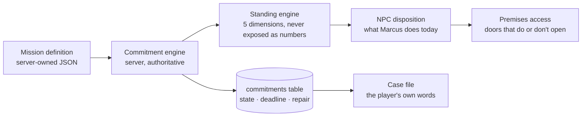

# Mission Design Bible

**Status:** Design, for founder sign-off. Nothing here is built yet.
**Date:** 3 August 2026
**Answers:** master directive §16 · founder instruction 3 August ("the missions we have are placeholders — plan how we're going to do these, thinking about how other games work")
**Depends on:** [MASTER-REPOSITORY-AUDIT.md](../01-audit/MASTER-REPOSITORY-AUDIT.md) §E (vision alignment)

---

## 1. Why the current missions fail

Be precise about this, because the fix follows from the diagnosis.

The six chapters have missions like `walk` ("Get your bearings"), `board` ("Read the board"), `stash` ("Find the archive"), `inspect` ("Inspect the drop"), `own1` ("First move", `type: purchase_count`). Each carries a `moralFocus` caption — "Awareness: you are not stuck forever."

**The captions are good. The verbs are the problem.**

Every mission in the game is one of: *go somewhere*, *look at something*, *find a hidden object*, *buy something*. Those are the verbs of a collectathon. The Bible's subject is a **pattern of behaviour sustained over time** — "replacing short-term survival thinking with long-term ownership" (Vol 7). A fetch quest happens in an instant and asks nothing of you afterwards.

So the game currently *says* untrapping and *does* looting. The player's hands are doing one thing while the text says another. That gap is the single biggest design problem in the project, and no amount of better copy closes it — because the player believes their hands.

There is a second, sharper failure. Mission `own1` is `type: purchase_count, requirement: 1` — **you clear it by buying something.** Vol 11 says rewards come from participation, not spend. The game's third mission contradicts the doctrine directly.

### What the world already gets right

The block brightens from dusk to daylight as chapters clear (`MOODS`, `freeRoamWorld.js`). That is the moral arc carried by art rather than text, and it is the model everything below follows: **the systems say it, so the script doesn't have to.**

---

## 2. What the reference games actually teach

Your brief named a shelf of open worlds. Taking the *principle* rather than the feature, as instructed:

| Game | The system that works | Why players respond | What TRP23 takes |
|---|---|---|---|
| **Kingdom Come: Deliverance** | You start incompetent and get better by doing things badly in public. You literally cannot read. | Competence you *earned* is worth more than competence you were given. The early humiliation is the point. | **Practice as a mechanic.** Skill comes from visible, repeated, initially-bad attempts — not from an XP bar |
| **Red Dead Redemption 2** | Honour accumulates from hundreds of small unannounced choices | It never tells you it's watching, so it feels like character rather than score | **Never show a morality meter.** Consequence surfaces as changed behaviour from NPCs, not a number |
| **Disco Elysium** | Your own skills are characters who argue with you, and give bad advice | The antagonist is internal — exactly right for a game about a trap | **The trap speaks in your own voice.** See §4, the Inner Voice |
| **Animal Crossing** | You return because things grew and someone noticed you were away | Retention without streaks, guilt or FOMO | **Non-manipulative return loop.** The world moved on; nobody punishes you |
| **The Sims** | Needs generate story with no authored content | Pressure creates narrative for free | **Standing decays slowly.** Maintenance is a real cost |
| **Rust / DayZ** | Reputation is real because the population is small and persistent | People remember you | **A small named cast who remember** — Tier 2 NPCs |
| **GTA / Watch Dogs** | The city is a systemic playground | The world is the strongest part; the missions are the weakest | **Put the design budget in the world and the systems, not in scripted set-pieces** |
| **Second Life** | Player-run commerce is genuinely compelling | Real stakes | Works — **but only with verification.** See the Premises doc |
| **Fortnite / live-service** | Battle passes, streaks, daily login | Effective and **manipulative** | **Reject.** §9 |

**The synthesis:** the strongest open-world systems all measure something *across time* and let the world respond *without commentary*. That is also, precisely, what Trapology is about. The doctrine and the craft agree — which is lucky, and is the foundation for everything below.

---

## 3. The core mechanic: the Commitment

> **A TRP23 mission is not a task you complete. It is a commitment you keep or break, measured over time, that the world remembers.**

This one sentence resolves the ludonarrative problem. The trap is a *pattern*; so the mechanic is a *pattern*.

### How it works

1. **You state it.** Not "accept quest" — you choose the terms. *"I'll be at the workshop Thursday."* *"I'll put 200 aside each session for four sessions."* Player-set difficulty: you pick the size of your own promise.
2. **It has a deadline in real elapsed time** — sessions or days, not minutes. A commitment you can satisfy in ninety seconds is a fetch quest again.
3. **The world holds it.** Server-side, persistent, visible on your case file. It does not nag.
4. **Keeping it builds Trust. Breaking it costs Trust** — and Trust is not a score you see. It is *whether Marcus opens the workshop for you on a wet Tuesday.*
5. **Every break has a repair path.** Always. This is doctrine, not kindness — Vol 4: accountability *without humiliation*. Repair costs more than keeping it did, and it works.

### Why this is right for Trapology

- Discipline becomes something you *do*, not something you're told.
- Failure is survivable and recoverable, which is the Bible's whole argument.
- It generates story without authored content: a broken promise is a scene.
- It works identically for a fictional NPC and **a real barber's appointment** — see §7. That is the killer application.

### The anti-pattern this must avoid

This must never become a chore list or a streak counter. Guards:

- **No streaks.** Nothing counts consecutive days. Breaking one is not a cliff.
- **No push notifications** to guilt you back.
- **Commitments expire quietly.** A lapsed commitment is "that didn't happen", not a red failure banner.
- **You can decline to commit.** Always. Not committing is neutral, never punished.
- **The cap is low** — 2 or 3 open commitments. Otherwise it is a job.

---

## 4. Mission grammar: the seven verbs

Every mission is built from these. If a proposed mission is none of them, it does not belong.

| Verb | What the player does | Trapology basis | Example |
|---|---|---|---|
| **COMMIT** | State an intention with a deadline; keep or break it | Discipline; ownership | "Be at the barber Thursday 4pm" |
| **PRACTISE** | Do a thing badly, repeatedly, get visibly better | Craft over chaos (Vol 2) | Cut a fade. First one is bad. Tenth isn't |
| **CHOOSE** | Fast money vs slow build, with genuine opportunity cost | Short-term survival vs long-term ownership | £200 tonight, or the Thursday slot that leads somewhere |
| **REPAIR** | Restore something you broke — trust, a space, a relationship | Accountability without humiliation (Vol 4) | You no-showed. Now what? |
| **NOTICE** | Recognise, don't collect. Spot the manipulation, the escalation, the tell | Awareness; separating circumstance from identity | Someone's setting you up. Nothing highlights it |
| **VOUCH** | Put your own standing behind someone else | Community; reputation as capital | Recommend someone for the slot. If they no-show, *you* pay |
| **BUILD** | Transform a space or make a thing that persists | Enterprise; creativity | Turn the vacant unit into something |

**Deliberately absent: FETCH, KILL, COLLECT.** No mission in TRP23 is cleared by acquiring an object. The `stash` mission survives only because it was reframed as *reading someone's testimony* — and even that should become a NOTICE.

### Why NOTICE matters more than it looks

Games teach you to find things by highlighting them. NOTICE removes the highlight. Someone in a conversation is working you — the tell is in what they said two lines ago, and there is no glowing outline. Get it wrong and you're out of pocket, and the game never says "WRONG CHOICE."

This is the mechanic that teaches street awareness *as a skill you actually have*, not a stat you bought. It's also cheap to build: it's dialogue and consequence, no art.

---

## 5. Progression: five dimensions, all with a downside

Your brief listed thirteen possible dimensions. Thirteen is unshippable and unreadable. Five, each with a genuine trade-off, because a trait that only helps is just XP with a nicer name.

| Dimension | Earned by | Opens | **Costs you** |
|---|---|---|---|
| **Trust** | Kept commitments, repairs | Doors, credit, the good slot, tenancy | Slow to build, fast to lose. People *expect* things of you |
| **Craft** | PRACTISE, repetition, finished work | Paid work, better product, teaching others | Time. Every hour on craft is an hour not earning |
| **Street** | NOTICE, surviving being played | Seeing setups coming, better prices, reading rooms | **Legit people find you guarded.** High Street lowers first-impression Trust with Tier 2 NPCs |
| **Standing** | Public, legitimate, visible activity | Business account, tenancy, partnerships | **Visibility.** People ask you for things. Old associations resurface |
| **Steadiness** | Showing up over time; decays with absence | Everything compounds slightly | Requires maintenance. Not a streak — a slow drift |

### Rules

- **None of these is ever shown as a number.** The case file describes them in words: *"Marcus would open up for you."* / *"Marcus would need asking twice."*
- **No single "morality" score.** Explicitly rejected by the brief and it would be the most preachy possible design.
- **Street vs Standing is the central tension** and it is the Bible's actual subject. The skills that kept you alive in the trap are real skills that cost you something in the legitimate world. That trade-off *is* the game.
- **Coins are not progression.** Money is a resource. It buys things. It opens nothing.

---

## 6. The loops

| Loop | Duration | What happens |
|---|---|---|
| **30 seconds** | Moment | Walk Lincoln. Something catches your eye — a person, a door, a change since yesterday |
| **5 minutes** | Encounter | Talk to someone. A small CHOOSE or NOTICE. No mission marker required |
| **30 minutes** | Session | Advance a commitment, do a PRACTISE block, or make one real decision with consequences |
| **Session end** | — | Your case file updates in *your own words*, not a score screen |
| **Daily** | Return | The world moved. Marcus finished the job. The vacant unit has a TO LET sign. **Nobody rewards you for logging in** |
| **Chapter** | ~2–4 hours | One question about yourself, asked in mechanics, answered by what you actually did |
| **Season** | ~8 weeks | A real drop; a real city event mirrored in-game; the world's state carries forward |
| **Long term** | Months | Street-smart hustler → someone with a trade, a name and premises |

### The 30-second loop is the one to get right

It's the one that runs constantly and it's currently empty — you walk a beautiful, accurate, dead city. Before any mission system, the block needs **ambient life**: people with somewhere to be, shutters that open and close, a market that's there on Fridays. That's Tier 1 NPCs and it is the highest-value unbuilt thing in the project.

---

## 7. The flagship: the barber

> This is the most valuable mission in the game and it should be the vertical slice.

You told me a collaborator owns a real barber shop in Lincoln, and you want to walk in and book an appointment you actually get, in the actual building we've modelled.

**Nobody else can build this.** Not GTA, not Roblox, not Fortnite, not Second Life. It requires a real city rendered accurately, a real business that trusts you, and a game about keeping your word. You have all three. It is the demo that makes an investor sit forward.

### Why it's the perfect Trapology mission

A booking **is** a commitment, with a real person on the other end. Every mechanic in §3 becomes literal:

- **COMMIT** — you say Thursday at 4.
- The world holds it. It's on your case file.
- **You turn up in real life. Or you don't.**
- Keeping it builds Trust with an NPC *and* with a real human being.
- No-showing costs a real barber a real chair. **That's the consequence, and it's true.**
- **REPAIR** — you no-showed. You go back in and deal with it. That's the Bible in one scene.

### The design constraints that make it safe

Take these seriously; a real business and real people are involved.

| Risk | Design answer |
|---|---|
| **A no-show costs him a chair he can't resell** | **A real card deposit, paid to him, never converted to coins.** Revised 3 August — "no payment at all" doesn't survive contact with a real business. But see the Trust marriage below: **high Trust books without a deposit, low Trust pays one.** Trust becomes a credit rating you earned by keeping your word |
| **Financial regulation** | The deposit is an ordinary card payment for a real service — what Booksy and Fresha do. It is **not** stored value, because it never becomes coins. Coins and real money never convert in either direction, which is what keeps this simple. See [REAL-WORLD-INTEGRATION-REGISTER.md](../05-operations/REAL-WORLD-INTEGRATION-REGISTER.md) §1 |
| **Minors travelling to meet an adult** | Booking requires a **verified account with a stated age**. Under-18 bookings are flagged to the barber and require a guardian contact, or are disabled at launch. No guest bookings, ever |
| **The barber's diary gets griefed** | Barber confirms every booking; nothing auto-commits his time. Rate limit: one open booking per player. Trust floor required to book at all — you earn the right to waste his time |
| **Player personal data** | The barber sees a **first name and a booking code**. Nothing else. Not the email, not the address, not the game profile |
| **No-show punishment is unfair** | Illness, no bus fare, a bad week. So: **the barber can waive it**, one-tap, and a waived no-show costs nothing. Repair always available. Never a permanent mark |
| **The barber cancels** | Costs the player **nothing**. Trust is not damaged by someone else's change of plan |
| **Safeguarding** | Real premises, real person: a reporting route on both sides. Kimani owns the project, so no third-party contract is needed — but **his customers are third parties**, and their data and safety are still ours to protect |
| **He gets bored of it** | It must save him time, not cost it. If his diary is already software, integrate; if it's a book, the game must not be a second system he has to check. **This is the open question that shapes the whole design** |

### The Trust marriage

Two mechanisms now do the same job — the deposit protects Kimani's money, Trust protects the game's meaning. Rather than run them in parallel, join them:

> **High Trust books without a deposit. Low Trust pays one.**

Trust stops being a soft narrative stat and becomes **financially meaningful — a credit rating earned by keeping your word.** A new player pays £5 to hold a slot; a player who has turned up six times running just books. That is the Bible's entire argument expressed as money, it gives a player a concrete reason to care about Trust from day one, and it is better than either mechanism alone.

### Earliest viable version

A `BOOKING` premises at his real OSM building; walk in, an NPC of him, pick from slots *he* published, get a code; he confirms in a one-page staff view that works on his phone between clients; it lands on your case file; turning up is a kept commitment. **Stripe test mode only. No calendar integration. No under-18s.** Buildable in weeks, and genuinely unprecedented to demo.

---

## 8. The bank is not a menu

You want NatWest on the High Street walk-in-able, with a teller for TRP coins. Right instinct — but a teller who only takes deposits is a UI with a face.

**The bank is where short-term survival thinking meets long-term ownership.** So the teller is the game's mirror:

- She notices patterns without judging them. *"Third time this week you've taken it all back out."* No penalty, no lecture, no morality hit. She just says the true thing.
- Money left alone does something *slowly* — slow enough that it teaches patience rather than optimal play.
- **Standing is what she actually gates.** Consistent, legitimate, visible activity gets you a business account. A business account is what lets you take a tenancy on a shopfront.

That closes the loop that makes the whole thing a platform:

```
show up  →  Trust  →  bank takes you seriously  →  Standing  →  business account
   ↑                                                                    ↓
   └──────────  you run premises, and others depend on you  ←──  tenancy on a shopfront
```

The bank isn't a feature. **It's the on-ramp to the merchant system** — which is your long-term shopfronts-for-rent goal. Design it as the tutorial for being a business, not as an ATM.

---

## 9. What we will not do

Named explicitly so they don't drift in later.

| Rejected | Why |
|---|---|
| Morality meter / karma bar | Turns a mirror into a scoreboard. Reduces reflection to optimisation |
| Good/bad dialogue wheels | Brief rejects them. Real choices don't announce which is which |
| Login streaks, daily rewards, FOMO timers | Manipulative. Contradicts a Bible about not being controlled |
| Loot boxes / randomised paid rewards | Gambling-adjacent, to a young audience. Absolute no |
| Missions cleared by purchasing | `own1` today. Contradicts Vol 11. **Remove it** |
| Crime as a power fantasy | Reputational and app-store risk; contradicts the doctrine |
| A "correct" ending | The Bible offers a way out, not a right answer |
| AI-generated NPC dialogue shipped unreviewed | Brief forbids it. Also: an unmoderated model in a game about vulnerable young people is a genuine safeguarding hazard |

---

## 10. Rebuilding the six chapters

Current chapters, re-verbed. Names kept — they're the founder's and they earn their keep once the mechanics disagree with the glamour.

| # | Chapter | Current | Becomes | Verbs |
|---|---|---|---|---|
| 01 | THE COME UP | Walk, read board, find archive | **Name your trap.** Write it on the blank card. The game holds it for five chapters | NOTICE, COMMIT |
| 02 | THE KITCHEN | Inspect drop, buy something, find archive | **Your first real choice.** Fast money tonight vs a Thursday slot that goes somewhere. Both are legitimate. Only one compounds | CHOOSE |
| 03 | THE GRAVEYARD SHIFT | Find archive | **Consistency under pressure.** A commitment across multiple real sessions while things go wrong | COMMIT, REPAIR |
| 04 | THE SHOP FLOOR | Find archive | **Standards are the difference.** PRACTISE a trade until the work is good enough to sell | PRACTISE, BUILD |
| 05 | TOP FLOOR | Find archive | **Someone needs vouching for.** Put your standing on the line for another person | VOUCH, NOTICE |
| 06 | THE WAREHOUSE | Find archive | **The card comes back.** "Does this still hold you?" Answered by what you actually did, not by a dialogue option | — |

**Chapter 01 and Chapter 06 are one mechanic** — the "name your trap" card from `Build_Progress.md` 7.1, already identified as the cheapest big win in the project. It is a text input, a database column and a callback five chapters later, and it is the emotional spine of the whole game. **Build it first.**

---

## 11. Authoring architecture

So this is data, not code, and a writer can work without an engineer.



Non-negotiables, following directly from the audit:

1. **Missions are server-owned data.** The client says *what it did*, never *what it is worth*. Exactly the rule that was just violated for two weeks in `/api/rewards/claim` — the mission system must be built with it from the first line.
2. **Commitments are server-side with real timestamps.** Client clocks are a cheat surface.
3. **Standing is derived, never client-writable.** `trustStatus` already exists in the schema and is already guarded against self-promotion. Use it.
4. **Everything is versioned and migrates**, following the `defaultContent.js` pattern that already exists.
5. **Mission `type`/`requirement`/`limit` must actually drive behaviour** — today they're decorative (`Build_Progress.md` 8.3).

---

## 12. What to build first

Ordered. Each is independently valuable and shippable.

| # | Build | Why first | Effort |
|---|---|---|---|
| 1 | **"Name your trap"** card + Chapter 06 callback | Emotional spine, near-zero tech, already scoped | S |
| 2 | **Commitment engine** — table, deadlines, keep/break/repair | Everything else depends on it | M |
| 3 | **Ambient life** — Tier 1 NPCs with somewhere to be | Fixes the dead-city problem; the 30-second loop | M |
| 4 | **The barber booking** | The unprecedented demo. Forces verification, no-shows and liability to be solved properly | M |
| 5 | **Bank teller + Standing** | On-ramp to the merchant system | M |
| 6 | **Chapter 02 rebuilt as CHOOSE** | Proves the grammar on real content | S |
| 7 | Remove `own1` (purchase-gated mission) | Doctrine contradiction; delete, don't redesign | XS |

**Not now:** player-rented shopfronts (needs the barber to prove the model first), multiplayer, procedural missions, AI dialogue, Tier 3/4 NPCs.

---

## 13. Open questions for the founder

1. **Has the barber agreed?** Nothing here is buildable without him, and how he currently runs his diary determines the whole design. **Please ask him before I build anything.**
2. **Under-18s and real bookings** — disable at launch, or build a guardian-consent path? *Recommendation: disable, ship the rest.*
3. **`own1`** — confirm I can delete the purchase-gated mission. It contradicts Vol 11 and I don't think it's close.
4. **Chapter names** — keep as-is? I think yes: once the mechanics stop rewarding the glamour, the names read as irony rather than aspiration. But it's your call and it's a real reputational decision.
5. Still outstanding from the audit: **did the committed database ever hold real player rows?** (GDPR), and the two-currency question (Trap Coins vs TRP).

---

*Design only. Nothing in this document is implemented.*
