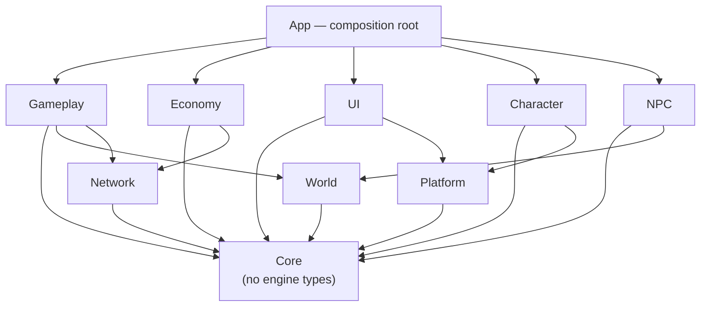

# Unity Technical Architecture

**The target architecture for the authoritative game client.**

**Date:** 4 August 2026 · **Status:** proposed, for owner approval. **Not implemented.**
**Evidence:** [UNITY-MIGRATION-AUDIT](../01-audit/UNITY-MIGRATION-AUDIT.md) · **Delivery:** [UNITY-MIGRATION-ROADMAP](../04-plan/UNITY-MIGRATION-ROADMAP.md)

> Designed against what is in `Unity/TRP23` today, not a generic Unity project. Where the repository already does something well — `PointerFocus`, `TrapCardState`, `TrapWorldSetup` — this generalises the existing pattern rather than replacing it.

---

## 1. The one-sentence shape

> **A thin composition root wires services into domains that talk through interfaces and events, over a world layer that already works, against a server that owns everything valuable.**

Three properties matter more than any diagram:

1. **A wrong dependency should fail to compile.** Assemblies, not conventions. Documented rules get ignored; the compiler does not.
2. **Nothing valuable is decided on the client.** Already true and tested — the architecture must make it hard to reverse.
3. **It must stay buildable throughout.** No big-bang restructure. Every step lands green.

---

## 2. Domains

Adjusted from the generic list where the repository justifies it. `Vehicles`, `Social` and `Audio` are **deliberately not created yet** — no consumer exists, and empty assemblies are how speculative abstractions get their foothold.

| Domain | Owns | Exists today? |
|---|---|---|
| **Core** | Pure logic, no engine surface. State machines, value types, arbitration registers | Partly — `TrapCardState`, `PointerFocus`, `GameFreeze` |
| **Platform** | Input, storage, safe areas, quality tiers, suspend/resume, platform identity | ❌ none |
| **Network** | HTTP, DTOs, retry, auth token, mapping DTO→domain | Partly — `Auth/*` services |
| **World** | Lincoln: tiles, terrain, buildings, collision, atmosphere, streaming | ✅ **strong** |
| **Character** | Controller, camera, appearance, animation | ⚠️ third-party, untracked |
| **Gameplay** | Chapters, missions, commitments, interaction, premises, case file | ❌ **the missing middle** |
| **Economy** | Wallet/bank/catalogue **presentation** — never arithmetic | Partly — `WalletService` |
| **UI** | UI Toolkit documents, controllers, HUD, panels, navigation | ✅ working |
| **NPC** | Schedules, crowds, navmesh agents | ❌ none |
| **EditorTools** | Scene assembly, validation, content generation | ✅ `TrapWorldSetup`, `TrapUiSetup` |

### Dependency rules



**Permitted:** downward only, as drawn. `Core` references nothing.

**Prohibited, and enforced by assemblies:**

- **World must never reference Gameplay.** Lincoln does not know what a mission is. This keeps the crown jewels reusable and testable.
- **UI must never reference Gameplay or Economy directly** — only `Core` interfaces and events. Otherwise the HUD becomes the god object it is already trending toward.
- **Nothing references App.** It is the only place that knows the concrete graph.
- **Core must not reference UnityEngine** where avoidable — that is what makes it testable without a licence, which is how `TrapCardState` is checked in CI today.
- **No domain references a platform SDK.** Only `Platform` does.

---

## 3. Services, not singletons

`SceneFlow` is already a de facto service locator (`SceneFlow.Ensure().Auth`) with `DontDestroyOnLoad`. It works, and it caused the 4 August guest bug: entering `TrapGame` directly produced a different object graph from entering via `TrapMenu`.

**Formalise it as a composition root** rather than replacing it with a DI framework:

```csharp
// App assembly. The ONLY place that knows concrete types.
public sealed class GameContext : MonoBehaviour
{
    public static GameContext Current { get; private set; }

    public IAuthService        Auth      { get; private set; }
    public IPlayerProfile      Profile   { get; private set; }
    public IWallet             Wallet    { get; private set; }
    public ICaseFile           CaseFile  { get; private set; }
    public IContentCatalogue   Content   { get; private set; }
    public IPlatformServices   Platform  { get; private set; }
    public IGameClock          Clock     { get; private set; }
}
```

**Why not a DI container:** one project, one team, no runtime graph swapping. A container would be ceremony. **Why not plain statics:** they cannot be substituted in a test and they hide dependencies.

**Rules.** One bootstrap scene constructs it. Every service is an interface. A `MonoBehaviour` receives services in `Awake` from the context — never by `FindAnyObjectByType`, which is the current pattern in `CameraBoom` and should be the last of its kind. Entering any scene directly must produce the same graph.

---

## 4. Events

Two mechanisms, and the distinction is the point.

**Direct interface calls** for request/response — "fetch the wallet", "save the card". Typed, awaitable, traceable.

**A typed event bus in Core** for broadcast — "chapter cleared", "commitment broken", "entered premises". Publishers do not know subscribers.

```csharp
public readonly struct ChapterCleared { public readonly string ChapterId; }
GameEvents.Publish(new ChapterCleared { ChapterId = "lvl-01" });
```

This is what wires `WorldAtmosphere.cleared` — an inspector slider today — to real progression without World referencing Gameplay.

**Not** `UnityEvent` in the inspector for cross-domain wiring: it is invisible to search, breaks silently on rename, and produces exactly the "which scene did you enter from" class of bug.

---

## 5. Asynchronous work

`UnityWebRequest` in coroutines today, callback-based. It works and is consistent.

**Keep coroutines at the boundary; do not introduce async/await broadly yet.** Rationale: coroutines cancel with the object, which is what `WalletService` relies on by living on the persistent `SceneFlow` object; async/await needs disciplined `CancellationToken` plumbing to avoid continuing into a destroyed scene. That discipline is worth adopting deliberately, not by accident.

**Required now regardless of style:** every request carries a timeout; failure is a value (`Result.Fail(reason)`), never an exception across a domain boundary; a 401 means *signed out*, distinct from *unreachable* — `WalletService` already does this and it is the right pattern.

---

## 6. DTOs are not domain models

`AuthModels.cs` are wire shapes for `JsonUtility` — `[Serializable]`, public fields, names matching the server exactly.

**They must not leak past `Network`.** A server rename should break one mapping function, not the whole game. So: DTOs live in `Network`, are `internal` where possible, and are mapped to `Core` domain types at the boundary.

```
Network:  [Serializable] class WalletPayload { public Coins wallet; }
   ↓ map
Core:     readonly struct Balances { public int Cash; public int Bank; }
```

`WalletService` already does exactly this — `WalletPayload` → `Balances`. **Generalise it.**

---

## 7. Server-authoritative state, reconciled

The client may **cache** and **predict presentation**. It may never **decide**.

| Situation | Behaviour |
|---|---|
| Read | Show cached, refresh in background, update on arrival |
| Write (value) | Optimistic UI **only** where the server's answer is already known — a mission's catalogue reward. Reconcile to the server's number always |
| Disagreement | **Server wins, silently.** No merge, no prompt |
| Offline | Reads from cache, marked stale. **Value writes are refused, not queued** |
| Reconnect | Refetch authoritative state; discard local guesses |

**Value writes are never queued offline.** A queue is a promise the server never made, and a player who spends coins on a train and lands on "that did not happen" has been lied to by the interface.

---

## 8. Scenes

| Scene | Contents | Lifetime |
|---|---|---|
| **Bootstrap** | `GameContext`, platform init, settings. Loads Frontend | ~1 s, then unloaded |
| **Frontend** | Menu, auth, character creation | Until play |
| **World** | Lincoln root, streamer, atmosphere, player | Whole session |
| **Interiors** (additive) | Kimani's, NatWest, chapters | While inside |
| **Mission content** (additive) | Per-mission props and actors | Per mission |

**Today:** `TrapMenu` → `TrapGame`, both single-loaded, `SceneFlow` surviving via `DontDestroyOnLoad`.

**The change that matters is Bootstrap.** It guarantees one object graph however you entered — which is precisely the 4 August guest bug, and it will recur in other shapes until it exists.

**Interiors additive rather than separate loads:** the street stays resident, so stepping out of the barber's is instant and the city behind the door is real. Costs memory; that is what the budget is for.

---

## 9. Testing

Mirrors [TESTING-STRATEGY](TESTING-STRATEGY.md), which is already the repository's approach — the point here is that **pure logic in `Core` is testable in CI without a Unity licence today.** `TrapCardState` proves it: 21 cases across two languages, run on every push.

| Layer | Where | Runs in CI now? |
|---|---|---|
| Pure logic | `check:csharp` + shared tables | ✅ **yes** |
| Geometry | `check:world` | ✅ yes |
| API contract | `check:api` (52 checks) | ✅ yes |
| Cross-client parity | `check:trap` | ✅ yes |
| EditMode | Unity Test Framework | ❌ needs a licence |
| PlayMode | Unity Test Framework | ❌ needs a licence |
| Build verification | per platform | ❌ **blocked by the untracked player prefab** |

**Priority for automated coverage**, highest first: economy and reward paths (done, server-side) · save migrations · tile parsing and projection · commitment state machine · interaction resolution · UI state machines.

**The pattern to repeat:** put the decision in `Core` as a pure function, drive it from a shared JSON table, and let CI check every implementation against it. That is how a divergence between the JS and C# trap card was caught within minutes of the table existing.

---

## 10. What this architecture deliberately does not include

Because speculative abstractions with no consumer are their own failure mode:

**No networking/multiplayer layer** — no use case defined ([MULTIPLAYER-DECISION](MULTIPLAYER-DECISION.md)). **No Addressables** — nothing yet needs remote content. **No ECS/DOTS** — the scale does not warrant it and it would fragment the codebase. **No vehicles, audio or social domains** — no consumer. **No localisation** — one market. **No console SDKs** — [PLATFORM-ARCHITECTURE](PLATFORM-ARCHITECTURE.md) keeps the seams open; that is all that is warranted now.
