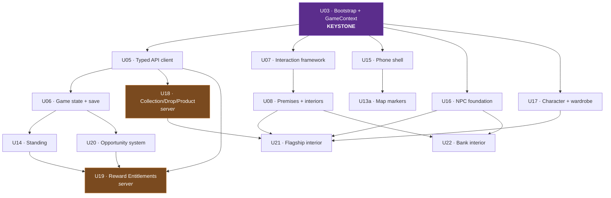

# Implementation Dependency Map

**What we build, and in what order, to reach the High Street session.**

**Date:** 9 August 2026 · **Status:** 🟡 **planning only. Nothing implemented, nothing authorised.**
**Baseline:** D-W23 — the Bible, [WORLD-AND-GAMEPLAY-SPECIFICATION](../02-design/WORLD-AND-GAMEPLAY-SPECIFICATION.md), [HIGH-STREET-SESSION](../02-design/HIGH-STREET-SESSION.md) rev 3, [DECISION-REGISTER](DECISION-REGISTER.md), [WORLD-EXPERIENCE-RECONCILIATION](../01-audit/WORLD-EXPERIENCE-RECONCILIATION.md)
**Reconciles:** [UNITY-MIGRATION-ROADMAP](UNITY-MIGRATION-ROADMAP.md) · [PROGRESS](PROGRESS.md)

> **This does not create a competing roadmap.** It reconciles the existing U-series against the frozen product design, retires what the design has obsoleted, and adds only what the session genuinely requires.

---

## 1 · Roadmap assessment — and a collision to fix first

**The repository currently has two overlapping numbering schemes**, and nobody noticed because neither had started.

| Old Horizon-1 entry | Duplicates | Verdict |
|---|---|---|
| `010` Unity chapter/scene flow + game state | **U06** | 🗑️ retire — U06 supersedes |
| `011` Server-driven content in Unity | **U09** *(identical title)* | 🗑️ retire |
| `014` Ambient life — Tier 1 NPCs | **U11** | 🗑️ retire |
| `015` Premises system + one interior | **U08** | 🗑️ retire |
| `019` Versioned save/load | **U06** | 🗑️ retire |
| `020` Performance budgets + scene validation | **U12** | 🗑️ retire |

**Recommendation: the U-series is the Unity roadmap. The surviving 0xx entries are `012` (character archetypes), `013` (commitment engine), `016` (bank/Standing), `017` (barber booking), `021`–`023` (mobile, accessibility, analytics), and they should be renumbered into the U-series when touched.** Left as-is, somebody will build `011` and `U09` twice.

### The existing U-series against the frozen design

| WP | Status | Verdict |
|---|---|---|
| **U01** asmdefs | ✅ done | — |
| **U02** owned controller | ✅ done, pending H-13b | — |
| **U03** bootstrap + GameContext | ⬜ | ✅ **correct and unchanged.** Still the keystone; still the only thing that breaks the `Auth ↔ SceneFlow` cycle |
| **U04** platform + IL2CPP | ⬜ | ✅ correct. **Can move later** — nothing in the session needs it, and it costs a human device run |
| **U05** typed API client | ⬜ | ⚠️ **grows.** Must now also carry world clock/weather, entitlements and campaigns |
| **U06** game state + save | ⬜ | ⚠️ **grows.** Now needs Standing, and D-W13's home-is-also-chapter-one |
| **U07** interaction framework | ⬜ | ✅ **correct and now more central.** D-W10 makes everything physical — doors, NPCs, ATM, counters, rails, wardrobe |
| **U08** premises + interior | ⬜ | ⚠️ **retarget.** Was "Kimani's interior"; D-W04 removes the character and the session needs the **flagship** first |
| **U09** server-driven content | ⬜ | ⚠️ **grows** into the Collection/Drop/Product model (D-W02) |
| **U10–U12** slice dressing, pedestrians, budgets | ⬜ | ✅ correct, still late |
| **U13** navigational map | ⬜ backlog | ⚠️ **partially promoted.** The session needs markers and named locations, not routing |
| **026** offline map | ⬜ | ✅ correct, independent |

**Nothing in the existing roadmap is wrong. Three packages grow, one retargets, one splits.**

---

## 2 · New packages the frozen design requires

Nine, none of them inventions — each traces to a decision or a session beat.

| ID | Package | Why it exists |
|---|---|---|
| **U14** | Standing system | D-W16, five dimensions, spec §8. Nothing exists |
| **U15** | Phone shell + apps | D-W08. Nothing exists |
| **U16** | NPC foundation | Naomi, the teller, the barber. **Zero NPCs exist** |
| **U17** | Character presentation + wardrobe | The player is a capsule; the product is clothing |
| **U18** | Collection / Drop / Product model | D-W02. Server-side. Today's is a flat catalogue |
| **U19** | Reward Entitlements + funded campaigns | D-W11, D-W15. Server-side. Does not exist |
| **U20** | Opportunity system | D-W18 — **not** missions, **not** jobs. Contextual, offered, declinable |
| **U21** | Flagship interior + drop presentation | The hero location |
| **U22** | Bank interior + teller | D-W10, physical banking |

---

## 3 · Dependency graph



### Strict prerequisites

**U03 gates everything.** Not for tidiness: it creates `GameContext`, which is the only thing that breaks the `Auth ↔ SceneFlow` cycle (WP-U01 §2), and it is what makes entering any scene produce the same object graph — the cause of the 4 August guest bug. **Every package below it needs services it does not currently have a way to obtain.**

Then: `U05 → U06` (state needs a client) · `U06 → U14` (Standing is state) · `U07 → U08` (interiors need doors) · `U16 → U21/U22` (a shop with nobody in it is a room) · `U18 → U21` (a flagship with no drop is a wall).

### Parallel branches

Once U03 lands, **four independent branches**:

| Branch | Packages | Blocked by |
|---|---|---|
| **Data** | U05 → U06 → U14 · U18 · U19 | each other only |
| **World** | U07 → U08 → U21/U22 | U16 at the end |
| **Presence** | U16 · U17 | nothing after U03 |
| **Surface** | U15 → U13a | nothing after U03 |

**Presence and Surface are the visible ones and neither blocks anything else** — which is what makes early visible progress affordable rather than a compromise.

### Critical path

```
U03 → U05 → U06 → U14 → U19 → (session complete)
              ↘ U18 → U21
```

**Longest chain: U03 · U05 · U06 · U14 · U19.** Everything else fits alongside it. **U14 (Standing) is the least obvious critical-path item** and the easiest to defer by accident — but the session's entitlement is issued *because of behaviour*, so Standing is upstream of the reward, not decoration beside it.

### Product vs technical dependencies

| | |
|---|---|
| **Technical** — must be true or it will not work | U03 · U05 · U07 · U16 |
| **Product** — must be true or it is not TRP23 | U14 Standing · U18 drops · U19 entitlements · U20 opportunities |

**A slice with all the technical work and none of the product work is a walking simulator in Lincoln.** That is the failure mode this map exists to prevent.

---

## 4 · Proposed sequence

Ordered, with size. Prefer S/M throughout; nothing XL survives unsplit.

| # | ID | Package | Size | Depends | Visible? |
|---|---|---|---|---|---|
| 1 | **U03** | Bootstrap + GameContext + break the auth cycle | **M** | U01 | ❌ |
| 2 | **U17a** | Player character model + basic animation | **M** | U03 | ✅ **first visible** |
| 3 | **U16a** | NPC foundation — spawn, stand, look, be talked to | **M** | U03 | ✅ |
| 4 | **U07** | Interaction framework — one way to use anything | **M** | U03 | ✅ |
| 5 | **U15a** | Phone shell + map/messages | **M** | U03 | ✅ |
| 6 | **U05** | Typed API client · geo constants · world clock | **M** | U03 | ❌ |
| 7 | **U08a** | Premises model + door/interior transitions | **M** | U07 | ✅ |
| 8 | **U21a** | Flagship interior shell | **M** | U08a, U16a | ✅ |
| 9 | **U18** | Collection/Drop/Product model *(server)* | **M** | U05 | ❌ |
| 10 | **U06** | Game state + versioned save | **L** | U05 | ❌ |
| 11 | **U22a** | Bank interior + teller | **M** | U08a, U16a | ✅ |
| 12 | **U14** | Standing — five dimensions, no numbers | **M** | U06 | partial |
| 13 | **U20** | Opportunity system | **M** | U06, U16a | ✅ |
| 14 | **U19** | Reward Entitlements + test campaigns *(server)* | **M** | U05, U14 | ✅ |
| 15 | **U17b** | Wardrobe + digital apparel on the character | **M** | U17a, U18 | ✅ |
| 16 | **U21b** | Drop presentation — the window, the rail, try-on | **M** | U21a, U17b, U18 | ✅ |
| 17 | **U13a** | Map markers + named locations | **S** | U15a | ✅ |
| 18 | **U11** | Ambient pedestrians | **M** | U16a | ✅ |
| 19 | **U12** | Performance budgets + scene validation | **M** | most | ❌ |
| 20 | **U04** | Platform abstraction + IL2CPP | **M** | U03 | ❌ |

**Deferred beyond the slice:** U13 full routing · U09 *(absorbed into U18)* · 026 offline map *(independent, any time)* · U24/U25 mobile parity and WebGL · barber booking *(needs the business conversation)*.

---

## 5 · First five recommended packages

| | Package | Why now |
|---|---|---|
| **1** | **U03 Bootstrap + GameContext** | Nothing else is safe first. It breaks the `Auth ↔ SceneFlow` cycle, which is the largest structural debt in the Unity project, and guarantees one object graph however a scene is entered |
| **2** | **U17a Player character model** | **The first thing you will see change.** The player is a capsule. A person walking Lincoln is the difference between a tech demo and a game, and it unblocks the wardrobe |
| **3** | **U16a NPC foundation** | Zero NPCs exist. Naomi, the teller and the barber all need the same substrate, and Lincoln is currently empty |
| **4** | **U07 Interaction framework** | D-W10 puts everything in the world. Build one way to use a door, a person, an ATM and a rail — **or build four bespoke ones and regret it** |
| **5** | **U15a Phone shell** | Small, self-contained, immediately visible, and the session opens on it |

**Numbers 2–5 are all parallel after U03**, all visible, and none blocks another. That is the answer to *"twenty invisible backend packages before anything changes on screen."*

---

## 6 · The first meaningful visible improvement

> **U17a — the player character.**

Everything since 3 August has been architecture: assemblies, gates, audits, specifications. **The player is still a capsule.** Replacing it with a person who walks Lincoln properly is the first change where the answer to *"what does it look like now?"* is not *"the same."*

It is also **safe**: it depends only on U03, touches no economy or server code, has a clean rollback boundary, and cannot break anything already verified.

**Second most visible for the effort: U15a, the Phone.** Self-contained UI Toolkit work with no world dependencies.

---

## 7 · Assets

Nothing purchased, nothing imported.

| Asset | Classification | Note |
|---|---|---|
| Player character model | **DECISION REQUIRED** | Build, commission, or licensed base mesh. **Licensing must be checked for console** |
| Locomotion animation | **UNITY ASSET / THIRD PARTY** | Walk/run/idle. Check redistribution terms before any import |
| NPC models | **TEMP PLACEHOLDER** → build | Same archetype rig as the player |
| NPC idle/gesture animation | **UNITY ASSET / THIRD PARTY** | Standing, working, turning to talk |
| **Trap Made It garments** | **BUILD OURSELVES** | **The product. Cannot be bought or generated** |
| Shop fixtures — rails, counters, steamer | **BUILD** or **UNITY ASSET** | Modular; reused by all three interiors |
| Bank fixtures — counter, ATM, screens | **BUILD** or **UNITY ASSET** | Same kit |
| Barber fixtures | **UNITY ASSET / THIRD PARTY** | Deferred with the barber |
| Home props | **BUILD** — small set | Kettle, mattress, mirror, wardrobe. **Deliberately sparse is the point** |
| Signage | **GENERATE/PROCEDURAL** | `CityTextures.cs` already does this well |
| Interior shells | **GENERATE/PROCEDURAL** | From OSM footprints, extruded inward |
| UI | **BUILD OURSELVES** | UI Toolkit; `TrapTokens.uss` exists |
| Audio | **DECISION REQUIRED** | None exists anywhere. Ambient street, footsteps, interiors |
| Lincoln environment | ✅ **already ours** | OSM + LIDAR, licence-clean |

**Two licensing flags.** Any character or animation package must permit **console redistribution** — checked before import, not after. And **Starter Assets must not return**: `check:repo` fails on any tracked reference to it (WP-U02).

---

## 8 · Owner actions

| | Action | Blocks |
|---|---|---|
| 🔴 | **H-13b** — re-test the map freeze in Unity | WP-U02 acceptance, and therefore U03 |
| 🔴 | **Choose the starter-home building** (D-W20 — a deliberate Lincoln location review) | U08a, and the session's opening |
| 🟠 | **Decide the character-model route** — build, commission or licence | U17a, the first visible package |
| 🟠 | **H-04** — prove the backups restore | WP-005 ledger work |
| 🟠 | **H-11** — an email provider | Account recovery reaching anyone |
| 🟡 | Approve a **test funded campaign** with zero liability | U19 |

---

## 9 · Remaining blockers

| | Blocker | Effect |
|---|---|---|
| **1** | **WP-U02 unverified** — H-13b outstanding | U03 should not start on an unaccepted foundation |
| **2** | **Starter home unchosen** (D-W20) | The session opens somewhere that does not exist |
| **3** | **Character model route undecided** | U17a is the first visible package and cannot start |
| **4** | **No audio strategy at all** | Not blocking, but a silent Lincoln will be conspicuous |
| **5** | **Roadmap collision** (§1) | Two numbering schemes; risk of building `011` and `U09` twice |
| **6** | **Ledger idempotency** (D2, WP-005) | Should precede U19 issuing anything with value |

---

## 10 · Recommendation

> **Authorise WP-U03 — Bootstrap scene and composition root.**

**Why it, and why first.** Every package in §4 needs services from a graph that does not yet exist, and U03 is the only one that resolves the `Auth ↔ SceneFlow` cycle — the largest structural debt left in the Unity project and the reason `TRP23.Network` cannot be extracted. It also ends the "which scene did you enter from?" class of bug that produced the guest failure on 4 August.

**Size M. No new art. No server changes. Clean rollback boundary.**

**One condition:** it should not begin until **H-13b** confirms WP-U02, because building the composition root on an unaccepted controller means any failure has two possible causes.

**And immediately after it, take U17a.** Not because it is urgent, but because five months of architecture deserves a person walking down the High Street, and it is genuinely the cheapest visible win available.

---

*Planning only. No packages authorised, no code written, no Unity or backend changes.*
