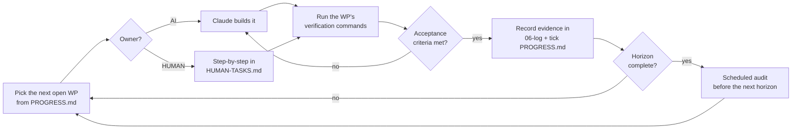

# TRP23 Master Plan

**The system we follow.** Everything that gets built passes through here.

**Version:** 1.0 · **Created:** 3 August 2026 · **Owner:** Richard (lead dev) + Kimani (founder)
**Grounded in:** [the master directive](../00-vision/TRP23_Master_Vision_and_Development_Plan.pdf) · [the Bible](../00-vision/bible/) · [the audit](../01-audit/MASTER-REPOSITORY-AUDIT.md)

---

## 1. The target, stated once

> **One game, built in Unity, that runs on PC, iPhone, Android and eventually consoles — set in a living Lincoln, where a clothing brand, a real barber's chair and a person's own case file all occupy the same world.**

Everything below serves that sentence. Anything that does not is rejected, however good it sounds.

**The web build is frozen.** It stays deployed as the instant-play shop window and receives bug fixes and content-data updates only. No new systems. ([Audit §G](../01-audit/MASTER-REPOSITORY-AUDIT.md))

---

## 2. How this system works

### The work package is the unit

Nothing is built that is not a **work package** (WP). A WP is small enough to finish, has acceptance criteria you can check, and names who does it — AI or human.

```
docs/04-plan/
  MASTER-PLAN.md        ← you are here. Strategy and horizons.
  PROGRESS.md           ← the ledger. Every WP, its status, its evidence.
  HUMAN-TASKS.md        ← the things only a person can do, step by step.
  DECISION-REGISTER.md  ← every decision, who made it, when, and why.
  AUDIT-SCHEDULE.md     ← when we stop and check ourselves.
  work-packages/
    _TEMPLATE.md
    WP-004-continuous-integration.md
    ...
```

### The loop



### The rules, and they are not negotiable

1. **Done means verified, not written.** A WP is ticked only when its verification commands were actually run and the output is in [`06-log/CLAUDE-EXECUTION-LOG.md`](../06-log/CLAUDE-EXECUTION-LOG.md). *"It should work"* is not done.
2. **One WP at a time.** Parallel half-finished work is how the repo grew three clients.
3. **Every WP names its "not included".** Scope creep is prevented in writing, before the work starts.
4. **Full WPs are written one horizon ahead. No further.** Beyond that they are titles only. Writing a detailed spec for Horizon 4 today would be invention, and the directive is explicit: *do not assign fake precision when the evidence is insufficient.*
5. **Blocked is a status, not a failure.** Record what it is blocked on and move to the next WP.
6. **Audits happen at horizon boundaries** whether or not anything feels wrong. See [AUDIT-SCHEDULE.md](AUDIT-SCHEDULE.md).

### Who does what

| | AI (Claude) | Human (Richard) | Human (Kimani) |
|---|---|---|---|
| Code, tests, tooling, migrations | ✅ | review | — |
| Architecture and design docs | ✅ drafts | approve | — |
| Running Unity, looking at things | ❌ **cannot** | ✅ | ✅ |
| Art, 3D, garments, cinematics | ❌ | commission | direct |
| Accounts, credentials, contracts | ❌ **must not** | ✅ | ✅ |
| Legal, accounting, insurance | ❌ **must not** | engage | decide |
| Anything with real money | ❌ **must not** | ✅ | ✅ |
| Doctrine calls | ❌ | ❌ | ✅ |

**Model recommendation.** Use **Claude Opus** for architecture, design, audits, security and anything touching money or safeguarding — the reasoning depth is worth the cost where a mistake is expensive. Use **Claude Sonnet** for mechanical work: boilerplate, test scaffolding, doc formatting, repetitive refactors. Do not use a smaller model for economy, auth, or safeguarding code; those are exactly where a subtle wrong answer looks right.

---

## 3. The horizons

Effort bands, not dates: **S** ≈ days · **M** ≈ 1–3 weeks · **L** ≈ 1–2 months · **XL** ≈ a quarter+. One focused developer plus AI.

### Horizon 0 — Stabilise and understand · *in progress*

**Objective:** know exactly what exists, stop the bleeding, and make the project safe to build on.
**Player-visible result:** none. This horizon buys the right to trust everything after it.

| WP | Title | Owner | Status |
|---|---|---|---|
| 001 | Complete repository audit | AI | ✅ |
| 002 | Close the client-controlled money paths | AI | ✅ |
| 003 | Documentation restructure + this plan system | AI | ✅ |
| 004 | Continuous integration | AI | ✅ |
| 005 | Ledger idempotency and double-entry | AI | ⬜ |
| 006 | Founder decisions resolved and recorded | **HUMAN** | 🔨 |
| 007 | Backups, and a restore that has actually been tested | AI + **HUMAN** | ⬜ |
| 008 | Unity project health check and package audit | AI + **HUMAN** | ⬜ |
| 009 | Account recovery — reset, username, 2FA codes | AI | ✅ |

**Exit criteria:** CI green on every push · no client-writable value anywhere · a restore proven from backup · every §6 decision recorded · Horizon 0 audit passed.
**Not included:** any new gameplay.

---

### Horizon 1 — The Unity vertical slice

**Objective:** one district of Lincoln, in Unity, so good that it explains the whole project without a pitch deck.
**Player-visible result:** create a character, walk Lincoln, name your trap, keep a commitment, bank at NatWest, book a real appointment at Kimani's, buy one garment in test mode.

| WP | Title | Owner | Effort |
|---|---|---|---|
| 010 | Unity chapter/scene flow and game state | AI | M |
| 011 | Server-driven content in Unity (kill the hardcoded catalogue) | AI | S |
| 012 | Character creation — fixed archetypes | AI + art | L |
| 013 | The commitment engine | AI | M |
| 014 | Ambient life — Tier 1 NPCs | AI | M |
| 015 | Premises system + one authored interior | AI + art | M |
| 016 | The bank, and Standing | AI | M |
| 017 | **The barber booking** (Stripe test mode) | AI + **HUMAN** | M |
| 018 | Case file in Unity | AI | ✅ mostly |
| 019 | Versioned save/load | AI | S |
| 020 | Performance budgets + automated scene validation | AI | M |
| 021 | Mobile builds — first real iOS/Android device runs | **HUMAN** + AI | M |
| 022 | Accessibility baseline | AI | S |
| 023 | Analytics events with consent | AI | S |
| 024 | **Unity mobile parity with the deployed web build** | AI + **HUMAN** | L |
| 025 | Unity on the website — WebGL feasibility spike | AI + **HUMAN** | S |

**Exit criteria:** a stranger plays it on a phone and a PC without help and understands what TRP23 is · 60 FPS on target hardware · every valuable action server-authoritative.
**Not included:** multiplayer · player-rented shops · real payments taken · consoles · cities beyond Lincoln.

---

### Horizon 2 — Closed community demo

Accounts, expanded district, more chapters, first real fulfilment pilot, admin/ops UI, moderation and support tooling. Real money enters here — for garments and the barber deposit, **not** for coins.
**Not included:** open merchant selling · multiplayer.

### Horizon 3 — Public early access

Scalable backend (Postgres), commerce operations, fraud controls, live events, content pipeline, customer support, **console certification research begins**.

### Horizon 4 — Creator and merchant expansion

Tenancy Tier 1 (cosmetic leases) → evaluate → Tier 2/3. Creator tools. Controlled marketplace. **Tier 4 requires specialist legal advice and is not assumed.**

### Horizon 5 — Connected open-world platform

Expanded city, multiplayer *if a real use case has been proven*, advanced simulation, broader real-world connections, additional cities. **Console ports land here.**

---

## 4. What we had missed

Things not in the original directive that this plan adds, because leaving them out would cost more later.

| # | Gap | Why it matters | Where |
|---|---|---|---|
| 1 | **No account recovery exists.** No password reset, no email verification. | A player who forgets their password is permanently locked out — today, in production. | WP-004 sibling; [register §5.2](../05-operations/REAL-WORLD-INTEGRATION-REGISTER.md) |
| 2 | **Backups unproven.** SQLite on one volume. | An untested backup is not a backup. | WP-007 |
| 3 | **Garment fitting across body types** | The product *is* clothing. Continuous sliders make every future drop a month of fitting work. Archetypes make it finite. | WP-012 |
| 4 | **Console constraints are decided now, not later** | Certification forbids some things we might otherwise build — see §5. | [RELEASE-AND-PLATFORMS](../03-technical/RELEASE-AND-PLATFORMS.md) |
| 5 | **Two implementations of shared logic** | Already caused one real bug. Solved for the trap card; needs to be the general pattern. | WP-011 |
| 6 | **Kimani's diary is paper/DMs** | We are not integrating with a booking system — we are *becoming* one. That is a reliability commitment to a real business. | WP-017 |
| 7 | **Walk-in double-booking** | The single likeliest way to lose Kimani's trust in the system. | WP-017 |
| 8 | **No age gate anywhere** | Needed for ratings, for real bookings, and for anything with money. | WP-006, WP-017 |
| 9 | **`own2`/`own3` still purchase-gated** | Contradicts Vol 11. Needs replacement missions, not deletion. | WP-010 |
| 10 | **Unity says "LEVEL", content says "CHAPTER"** | Doctrine drift, visible to players. | WP-011 |

---

## 5. The console decision, made early on purpose

Consoles are named as an eventual target. That is not a build-setting change — it constrains decisions **now**:

- **Every platform holder must approve the build.** Certification covers content, stability, storefront rules and how real money is handled.
- **Real-money rent for player shops is the sharp one.** Selling ongoing digital access outside the platform's own billing is the kind of thing certification scrutinises. Keep tenancy billing **web-only, outside the game client**, and consoles stay possible. Build it as an in-game purchase and you may have to tear it out.
- **User-generated content needs moderation before a console will accept it.** Tier 1 tenancy (player-decorated spaces) is UGC. Plan moderation with the feature, not after.
- **Age ratings are per-territory** and will ask about drug references. The Bible's answer — this is a journey *out* — is a good one, but it must be designed in and evidenced.
- **Input, and never assuming a mouse.** Every UI built from Horizon 1 must be navigable on a gamepad. Retrofitting that across a finished game is miserable.

Full detail: [RELEASE-AND-PLATFORMS.md](../03-technical/RELEASE-AND-PLATFORMS.md).

---

## 6. Decisions blocking work right now

Full register with context: [DECISION-REGISTER.md](DECISION-REGISTER.md).

| # | Decision | Blocks | Who |
|---|---|---|---|
| D-01 | How does Kimani run his diary today? | WP-017 | Kimani |
| D-02 | Deposit amount + cancellation window | WP-017 | Kimani |
| D-03 | Under-18 bookings — disable at launch? *(rec: yes)* | WP-017 | Kimani |
| D-04 | Stripe direct or Shopify headless? *(rec: Shopify)* | H2 commerce | Both |
| D-05 | Fictionalise real trading names? *(rec: yes)* | WP-015 | Kimani |
| D-06 | Body archetype count *(rec: 6)* | WP-012 | Both |
| D-07 | Two-currency model — Trap Coins vs TRP *(rec: yes, separate)* | WP-005 | Kimani |
| D-08 | Accountant engaged for VAT | H2 | Richard |

---

## 7. Version control

- **Branch per work package:** `wp/004-continuous-integration`. Never commit straight to `main`.
- **Commit messages say what changed and why**, in the voice the repo already uses — full sentences, not `fix stuff`.
- **One WP per pull request.** The WP's acceptance criteria are the PR description.
- **`main` must always be green.** Once CI exists (WP-004), that is enforced rather than hoped for.
- **Tag each horizon exit:** `h0-complete`, `h1-vertical-slice`.
- **Never rewrite published history.** The one exception — purging the old database blob — is a founder decision and currently declined as not worth the disruption.

---

## 8. Testing

Full strategy: [TESTING-STRATEGY.md](../03-technical/TESTING-STRATEGY.md). The floor:

| Gate | Command | Covers |
|---|---|---|
| Build | `npm run build` | Web bundle compiles |
| Rooms | `npm run validate:rooms` | Asset registry integrity |
| API liveness | `npm run test:api` | Every route answers |
| Security + economy | `npm run check:api` | Auth, CORS, rate limits, **money**, case file |
| Shared logic parity | `npm run check:trap` | Web and Unity agree |
| C# | `npm run check:csharp` | Unity scripts compile without the editor |
| World | `npm run check:world` | Collision and geometry |
| Hygiene | `npm run check:repo` | No credentials or databases tracked |

**The rule that produced these:** every defect found gets a test before it gets a fix. The coin faucet survived two weeks because five gates passed over it — none of them looked at money.

---

## 9. Progress

Live status: **[PROGRESS.md](PROGRESS.md)**.

| Horizon | Packages | Done |
|---|---|---|
| 0 — Stabilise | 9 | 5 |
| 1 — Vertical slice | 16 | 0 (1 partial) |
| 2–5 | titles only, by design | — |
