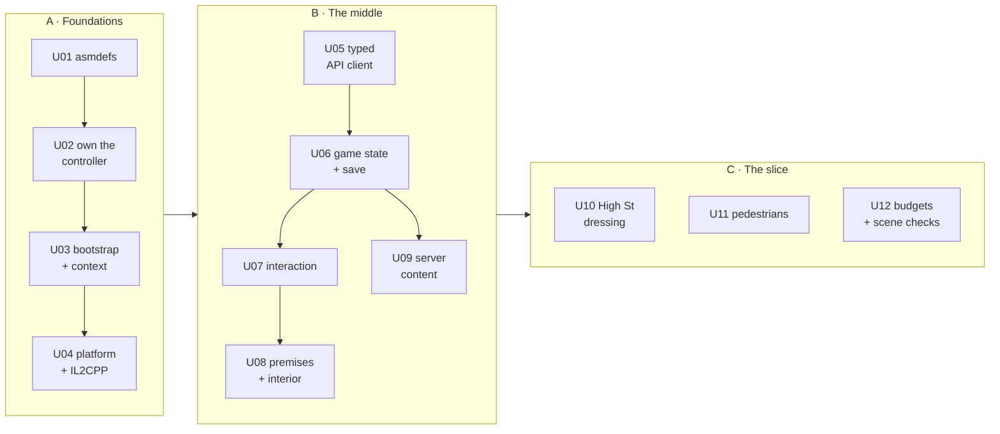

# Unity Migration Roadmap

**An ordered queue of independently implementable work packages.**

**Date:** 4 August 2026 · **Status:** proposed. **Nothing here is implemented.**
**Evidence:** [UNITY-MIGRATION-AUDIT](../01-audit/UNITY-MIGRATION-AUDIT.md) · **Design:** [UNITY-TECHNICAL-ARCHITECTURE](../03-technical/UNITY-TECHNICAL-ARCHITECTURE.md) · [PLATFORM-ARCHITECTURE](../03-technical/PLATFORM-ARCHITECTURE.md)
**Fits into:** [MASTER-PLAN](MASTER-PLAN.md) Horizon 1. Ledger: [PROGRESS](PROGRESS.md).

> Each package is sized so one coding agent can do it alone and the evidence can be reviewed before the next begins. **Do not start WP-U01 until the owner has answered §5.**

---

## 1. Sequencing logic

Three phases, and the order is not arbitrary.

**Phase A — make it buildable and bounded.** Nothing else is safe until a fresh clone builds and wrong dependencies fail to compile. Doing this after the game layer exists means retrofitting boundaries around code that already crossed them.

**Phase B — build the missing middle.** The game layer that does not exist. Each package is a vertical capability, not a horizontal tier.

**Phase C — make it a slice.** Content and polish on the High Street.

---

## 2. Phase A — foundations

### WP-U01 · Assembly definitions

**Objective:** replace one `Assembly-CSharp` with bounded assemblies, so a prohibited dependency fails to compile.

**Affects:** new `.asmdef` files under `Assets/`; `tools/csharp-check/check.csproj`.
**Prerequisites:** none. **Do first** — every later package is cheaper inside boundaries.
**Non-goals:** moving files between folders · renaming namespaces · splitting `TrapHudController` (that is WP-U06).

| Assembly | Responsibility | References | Tests |
|---|---|---|---|
| `TrapMadeIt.Core` | Pure logic, **no `UnityEngine`** where avoidable | — | ✅ `Core.Tests` |
| `TrapMadeIt.Platform` | Input, storage, safe area, quality, lifecycle | Core | ✅ |
| `TrapMadeIt.Network` | HTTP, DTOs, mapping | Core | ✅ `Network.Tests` |
| `TrapMadeIt.World` | Lincoln: tiles, terrain, buildings, collision, atmosphere | Core | ✅ `World.Tests` |
| `TrapMadeIt.Character` | Controller, camera, appearance | Core, Platform | — |
| `TrapMadeIt.Gameplay` | Chapters, missions, interaction, premises | Core, World, Network | ✅ `Gameplay.Tests` |
| `TrapMadeIt.UI` | UI Toolkit controllers | Core, Platform | — |
| `TrapMadeIt.App` | Composition root. The only place knowing concrete types | all | — |
| `TrapMadeIt.EditorTools` | Scene assembly, validation (Editor-only) | all | — |

Nine, not twenty. Each is a boundary that will still make sense at ten times the size.

**Implementation outline:** add asmdefs leaf-first (Core, then Platform/Network/World, then Gameplay/UI, then App); fix fallout at each step; update `check.csproj` to compile per-assembly so CI enforces the same graph.

**Acceptance:** project compiles · `npm run check:csharp` passes · **a deliberately-added `World → Gameplay` reference fails to compile** (demonstrate, then revert) · editor iteration time recorded before and after.
**Tests:** existing checks green; new empty test assemblies wired.
**Manual:** open Unity, confirm no errors, confirm both scenes still play.
**Risks:** circular references surfacing — likely, and finding them is the point. `TrapMinimap` owning cursor and pause for the whole game is the probable first casualty; extract into Core.

---

### WP-U02 · Own the character controller 🔴

**Objective:** a fresh clone builds a playable game.

**Affects:** new `Character/` scripts; `TrapWorldSetup.cs`; `.gitignore`; possibly removes `ThirdPersonController.cs`.
**Prerequisites:** WP-U01 · **owner decision (§5 Q1)**.
**Non-goals:** animation quality · IK · swimming/climbing · gamepad tuning (WP-U04).

**Why it must be early.** 3 of 273 StarterAssets files are tracked and `PlayerArmature.prefab` is not among them, so **CI can never build a player and a second developer gets a fly camera**. It also blocks console builds, and the file cannot be compile-checked because its dependencies are absent.

**Outline:** a ~300-line `TrapCharacterController` driven by the **already-tracked** `InputSystem_Actions` — which brings Keyboard&Mouse, Gamepad and Touch schemes with it. Keep `PlayerRig`'s hold-until-ground logic unchanged; it solves a real streaming problem well. Track a simple capsule + placeholder mesh so the repo is self-contained; real characters arrive with WP-012 archetypes.

**Acceptance:** `git clone` → open → play → **walk Lincoln**, with no Asset Store download · gamepad works without extra code · `check:csharp` covers the new controller (the old one could not be) · `PlayerRig` behaviour unchanged.
**Manual:** clone to a clean directory, open, press play.
**Risks:** feel regression versus Starter Assets — mitigate by keeping camera and gravity constants identical initially.

---

### WP-U03 · Bootstrap scene and composition root

**Objective:** one object graph regardless of which scene was entered.

**Affects:** new `Bootstrap.unity`; `SceneFlow.cs` → `GameContext`; scene load order.
**Prerequisites:** WP-U01. **Non-goals:** a DI container · additive world scenes (WP-U08).

**Why:** entering `TrapGame` directly produces a different graph from entering via `TrapMenu` — the direct cause of the 4 August bug where a signed-in guest was told to sign in. It will recur in other shapes until a single entry point exists.

**Outline:** `Bootstrap` constructs `GameContext` with interfaces, then loads Frontend. Entering any scene directly in the editor detects the missing context and loads Bootstrap first — so play-from-any-scene keeps working, which developers rely on.
**Acceptance:** pressing play from **any** scene yields an identical graph · guest and signed-in both resolve a playerId in every scene · no `FindAnyObjectByType` for services.
**Risks:** editor play-from-scene breaking — explicitly covered above.

---

### WP-U04 · Platform abstraction and IL2CPP

**Objective:** `IPlatformServices`; IL2CPP configured before it can hurt.

**Affects:** `Platform` assembly; `ProjectSettings`; quality tiers.
**Prerequisites:** WP-U01, U03. **Non-goals:** console SDKs · store integration · achievements beyond a no-op.

**Outline:** implement `IInputScheme`, `ILocalStorage`, `ISafeArea`, `IQualityTier`, `ILifecycle`; no-ops that **log** for identity and achievements. Set IL2CPP + ARM64 for Android and iOS. Expand quality tiers from 2 to 4 against the existing `PC_RPAsset` / `Mobile_RPAsset`.

**Why IL2CPP now:** it is mandatory for iOS and consoles, and it exposes AOT problems — reflection, generic virtual methods, `JsonUtility` edge cases — that Mono hides. Finding those in a quiet week beats finding them during a submission.
**Acceptance:** no gameplay assembly references a platform API · an Android IL2CPP build completes · safe-area insets respected on a notched device · quality tier detected and overridable.
**Manual:** **HUMAN** — build to a real Android device.
**Risks:** IL2CPP surfacing `JsonUtility` AOT failures. That is the point, and better now.

---

## 3. Phase B — the missing middle

### WP-U05 · Typed API client
Consolidate `HttpAuthService` / `WalletService` / `CaseFileService` into one `Network` layer: shared retry, timeout, auth header, 401 handling, and **DTO → domain mapping at the boundary**. Generate `TrapGeo` constants from `geo.js` via the existing export script, ending the hand-copied-projection risk. **Retire `MockAuthService`** — it re-types the server's signup regex. *Prereq: U01, U03. Acceptance: one HTTP path; DTOs never escape `Network`; a shared-table check proves the generated constants match `geo.js`.*

### WP-U06 · Game state and versioned save
The missing spine: chapter/mission state machine in `Core`, `IGameClock`, versioned local settings, server-backed player state, and the event bus. Wires `WorldAtmosphere.cleared` — an inspector slider — to real progression. Splits `TrapHudController` before it becomes the god object. *Prereq: U05 · **owner decisions Q2, Q4**. Acceptance: chapter state survives a restart; a save-version migration is exercised by a test; no valuable state in a local file.*

### WP-U07 · Interaction framework
One way to be near something and act on it: `IInteractable`, proximity detection, prompt display resolved per input device (`[E]` / `Ⓐ` / `TAP`), and the interaction event. Replaces the ad-hoc raycast in the web client and the `PointerFocus` special cases. *Prereq: U06. Acceptance: works on keyboard, gamepad and touch with no per-device branches in gameplay code.*

### WP-U08 · Premises and one authored interior
The `Premises` model from [MERCHANT-AND-PLAYER-BUSINESS-SYSTEM](../02-design/MERCHANT-AND-PLAYER-BUSINESS-SYSTEM.md), additive interior loading, and **Kimani's shop** as the first instance. *Prereq: U07 · **D-01**. Acceptance: walk in and out with the street resident; interior unloads on exit; memory returns to baseline.*

### WP-U09 · Server-driven content
Delete the hardcoded three-item catalogue in `TrapHudController`; consume `/api/content` and `/api/commerce/products`, ideally as generated ScriptableObjects so designers get inspector-editable data without a code change. Fix `LEVEL` → `CHAPTER`. *Prereq: U05. Acceptance: adding a product server-side appears in Unity with no rebuild.*

---

## 4. Phase C — the vertical slice

**The area: the High Street between the Stonebow and the foot of Steep Hill.** ~400 m of real street.

It contains, in reality, everything the slice needs to prove: **Kimani's shop**, the **NatWest on Mint Street** (already the map origin), dense continuous shopfronts, the start of the LIDAR climb, and enough foot traffic to justify pedestrians. Small area, commercial density — not a large empty map.

**In scope:** third-person movement (keyboard, gamepad, touch) · camera · streamed Lincoln with real terrain · one authored interior (the barber's) · interaction · one commitment · the case file · bank balance · one shop with server-driven products · save/load · weather and time · HUD and map · a real booking in Stripe **test mode**.

**Explicitly excluded:** the rest of Lincoln · traffic and vehicles · NPC schedules beyond ambient walking · dialogue trees · character creation (WP-012 runs in parallel) · multiplayer · real payments · player-rented shopfronts · consoles.

**Acceptance:** a stranger plays it on a phone and a PC without help and can say what TRP23 is · 60 FPS PC / 30 FPS mid-range Android · every valuable action server-authoritative · no console errors on a cold start.

**WP-U10** dressing and landmarks · **WP-U11** ambient pedestrians (navmesh package already installed, unused) · **WP-U12** performance budgets and automated scene validation — missing colliders, missing references, texture sizes, draw calls.

---

## 5. Owner decisions required before WP-U01

| # | Question | Blocks | Recommendation |
|---|---|---|---|
| **Q1** | Own the character controller, or commit 86 MB of Starter Assets? | U02, CI builds, consoles | **Own it.** Two patches already carried, uncheckable by CI, and ~300 lines is cheaper than that dependency in a submission |
| **Q2** | World time and weather — client or server? | U06, every timed mission | **Time server, weather client.** Time is shared truth; weather is presentation |
| **Q3** | Character appearance — server or local? | WP-012 | **Server.** Cosmetics will be sold; local means editable |
| **Q4** | `progress` blob → typed columns? | U06 and every future field | **Yes.** It is wholesale-replaced, which already forced a narrow route for the case file |
| **Q5** | Addressables now? | asset pipeline | **No.** No consumer. Revisit when interiors or DLC exist |
| **Q6** | Is the High Street the right slice? | all of Phase C | **Yes** — it is where the barber is |

---

## 6. What this roadmap deliberately does not do

No large refactor · no file moves for tidiness · no deletion of the web client · **no multiplayer** ([MULTIPLAYER-DECISION](../03-technical/MULTIPLAYER-DECISION.md)) · no console SDK work · no Addressables · **no change to the Lincoln pipeline**, which is the most valuable asset in the repository and has no evidenced reason to change.
